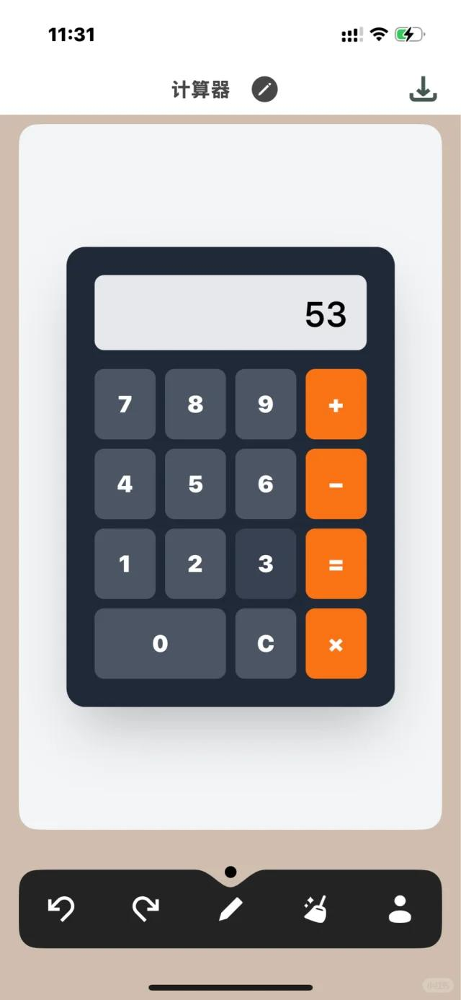
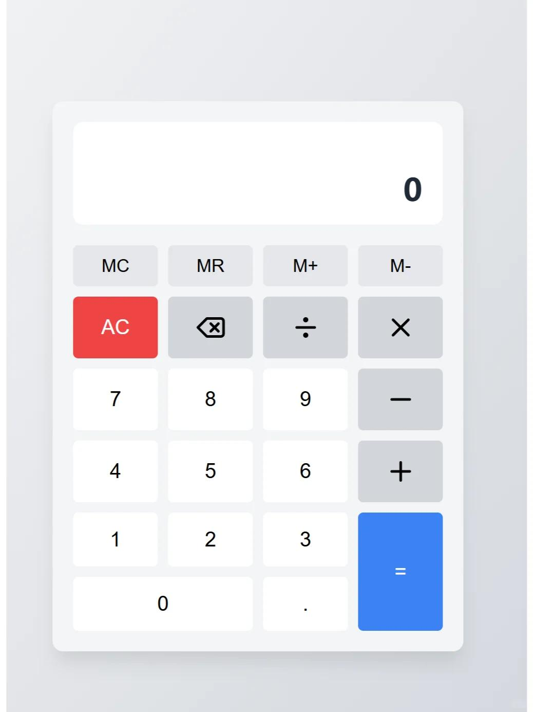
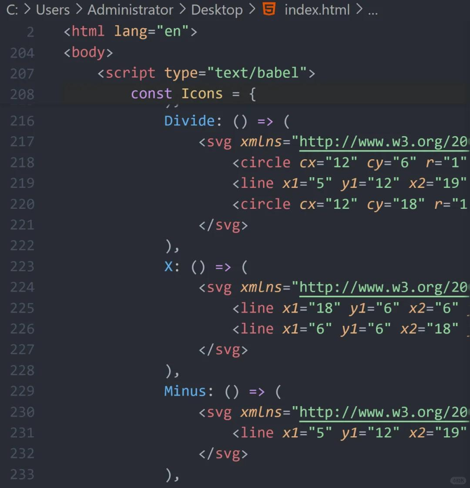

# AI的代码完成度太高，各位快跳船

 

 
没戏了，快撤吧。
下一个时代，软件开发的底层逻辑完全被改变了。
程序员要继续当，但是不要再走我们上一代人的老路了。
 
这个页面，我用15分钟，三轮对话，纯用Claude，就整出来了。这种速度，这种精致的页面，你知道真人去开发，需要多久的时间么？至少三天！甚至你还会写一些潜藏的bug。
但是现在，AI用了15分钟，薄纱了你传统编程。
 
十倍效率的差距，谁还用传统编程！？
一步步学语法，语言结构，做小Demo，做大项目，遇到问题求助谷歌。磨个一年半载到毕业生水平，在公司的实战练就到专业水平。这个路线没用了。
 
赶紧跳船！AI这种代码都信手拈来，那么可以预见的，以下技能会快速贬值：
1. 刷题能力。公司考核基于AI辅助编程，对公司的提效更有帮助。
2. 严格按照需求写代码的能力。
 
这段时间是个红利期，不要错过，你率先利用AI，就有先发优势。#5
#cursor #boltnew #V0 #claude