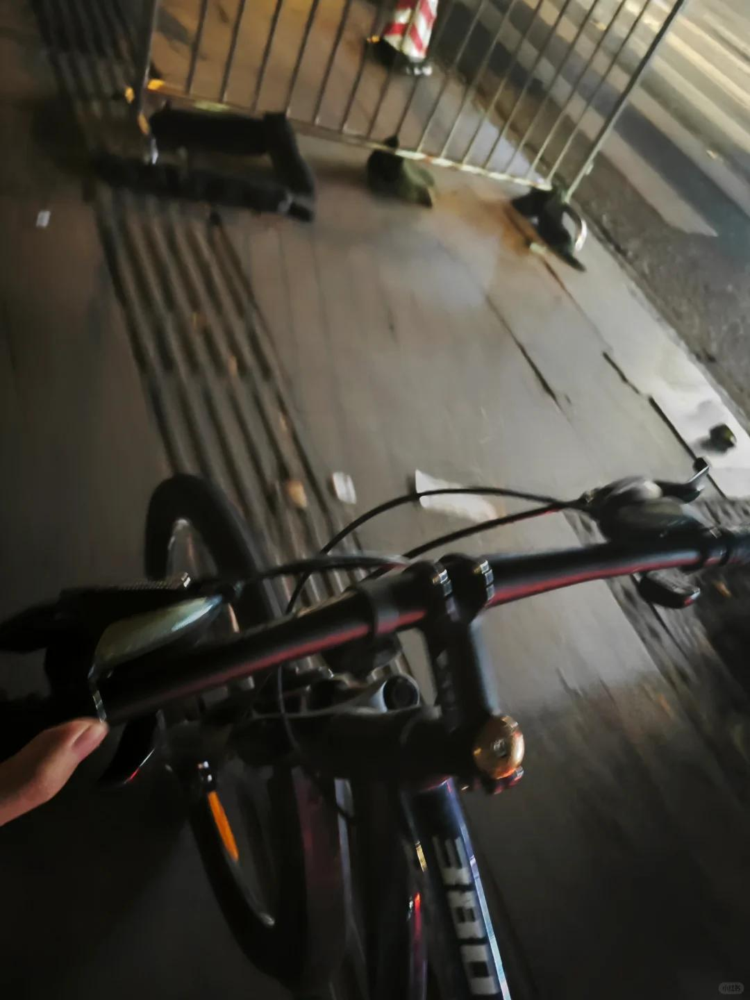

# 一个月花八百的日子

 
 
那时候，我刚毕业。月收入一万五。各位可能觉得很多，但是我当时真的觉得很少。
第一个月，我去了公司。才发现，我手上的钱，连第一个月的房租都支付不起。公司很人性化，甚至提前支给我们半个月的工资。
而且我不敢花钱，也觉得没有必要花钱。2500块我就可以买入一支万科的股票，这不是比乱花钱要好得多么。

我反而比起之前更加节俭。甚至做到了新房子连垃圾桶都不买。
不需要垃圾桶的，你不要点外卖，在家里不吃零食。哪里还需要垃圾桶呢？

后来，也就是在三年间，我的收入水涨船高，慢慢的，四五百一餐的饭，我支付时，眼睛也不眨一下了。

这就是金钱对人巨大的反向塑造啊