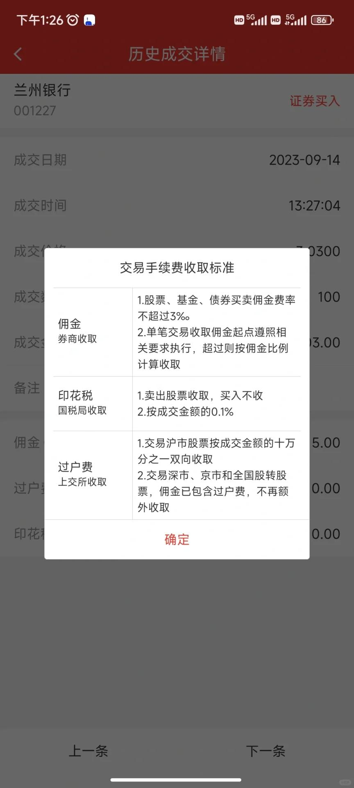

# 打工人手册#15 法

 
 
佛经上说，法不轻传。
因为轻易传递的法，必然不是真法。

道可以传，传递了，也无用。因为道这种T-1层面的东西，不是光明白就可以的。

每一个行业的知识都重要，但是又没那么重要。毕竟都是细节。

真正重要的，是心法。有了心法，你才能判断什么重要，什么不重要。
才知道如何不让自己那么累，也不让自己，深陷泥潭。更不让自己，把时间投入到别人的事业上。

什么是心法，心法是无数细节，无数经验的汇聚。是帮你在解决某一领域问题时，起到巨大作用的东西。

程序行业的心法是什么？我说一句：程序是对事物的映射与表达。
打工的心法是什么？我也说一句，是赚走钱和积累个人力量，尽量打通闭环。
赚钱的心法是什么？我再说一句，是构建赚钱的机器。