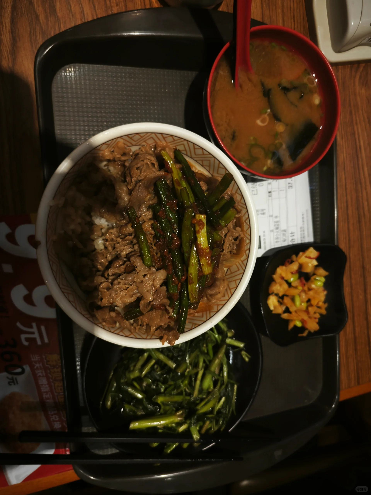

# 打工人手册#16 术

 
 
何为术？
举一个小学四年级的例子，十字相乘法。没有这个术，很多人可能一元二次方程解起来很吃力。

有了这个术之后呢，你花点心思这个问题就可以解决。

好的，想必你已经知道什么是真正的器了。对于计算领域那就是一个计算器。对于一元二次方程的解决，那就是一个一个chatgpt。

术是很有用的。

也是无数人试图在学的东西。

例如在软件领域学习经典设计模式，人际领域学习人际交往的一些技巧，销售领域学习商品包装话术。

这些都是术。

这些术是在很多领域可以批量复制的。道的构建很难，法需要聪慧，独创，善于总结。唯有术 你可以不停的学。

今天学习Excel的100个小技巧，明天学习Python某函数的使用。术很重要，如果你不掌握某个问题的术，你解决某个问题的时间，可能是某些人的好几倍。
但是术纷繁紊乱，如果没有心法把它串成一条线，无非只是术而已，一辈子也派不上真正大的用场。

这就是很多人一辈子学了很多术，最后都变成了屠龙之术。