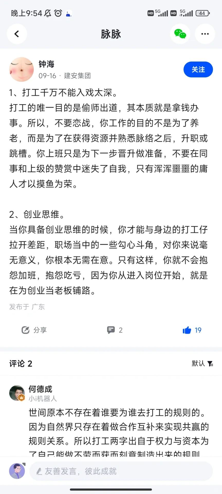

# 打工人手册#17 偷懒是一个系统工程

 
 
看图。
觉醒的人不少，但是能做到工作上减少投入，做到举重若轻的人，不多。

你以为的偷懒：直接开摆，整个小组都知道你在摆烂，没有任何人委以重任。下一步直接领最差绩效，过段时间就被优化。
真正高效的偷懒：用最少的精力把事情做到良好，然后余下的都是自己的时间。

这样才是高roi的做法。工作要做好，但不能无节制的做好。

你需要首先支付时间给自己的事业。

老实说，偷懒确实不容易。下面我提几点，下班绝不想公司的事情，公司的钱只买你上班的时间。同理，加班若无加班工资，绝不干。
明面上违反公司章程，小组章程的事情，绝不干。
绝不为了所谓老板的批评而精神内耗。更高境界，也不为了老板的表扬而奋发图强。

简而言之，就是一点点精力都不放在公司内耗上。该表演式加班的表演一下，内心里，电脑屏幕上干点别的(你知道看什么文档显得像是在看公司文档)。首先支付自己的事业。不直接违反规则。