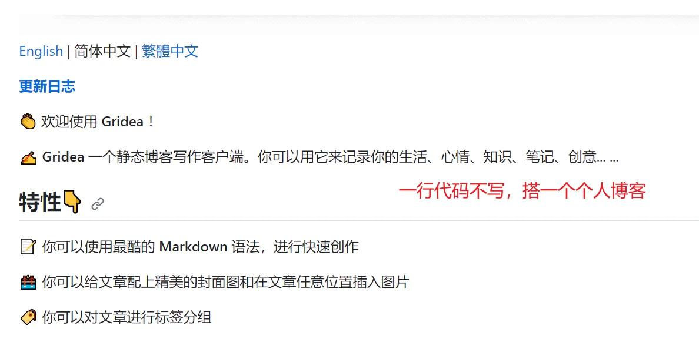
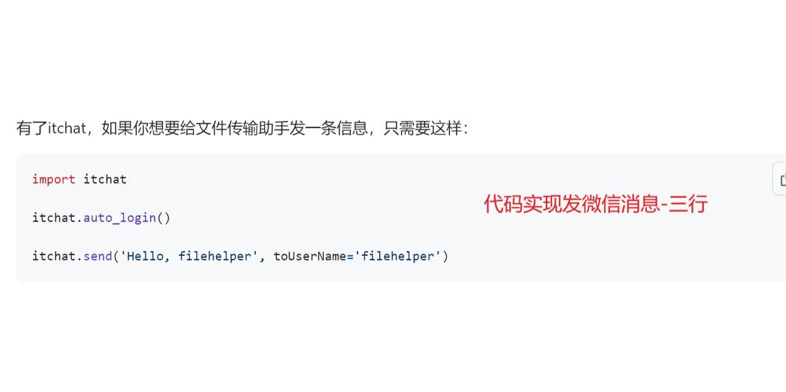
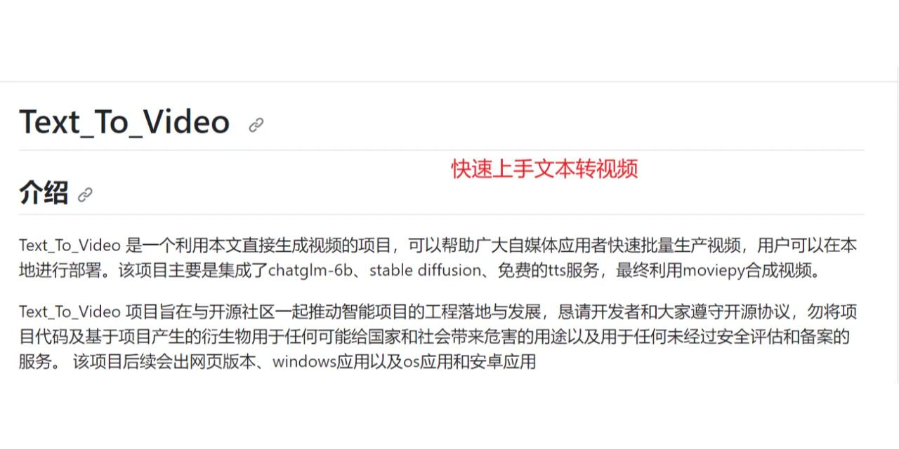
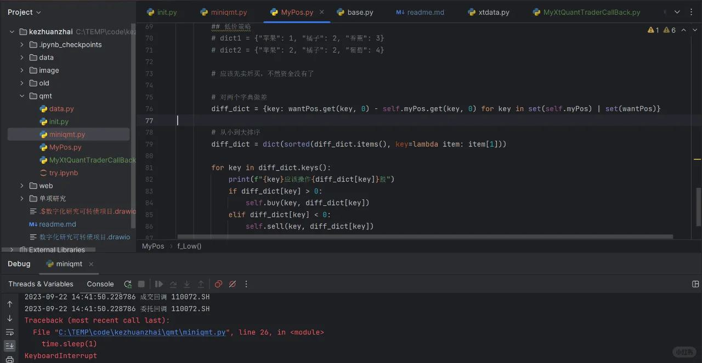
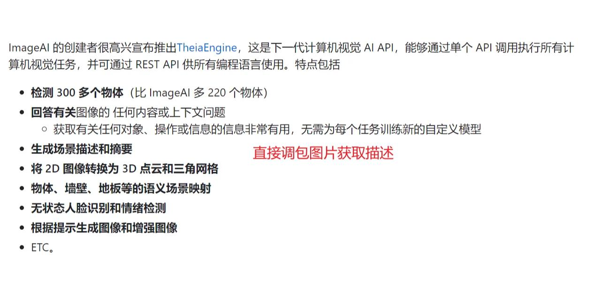
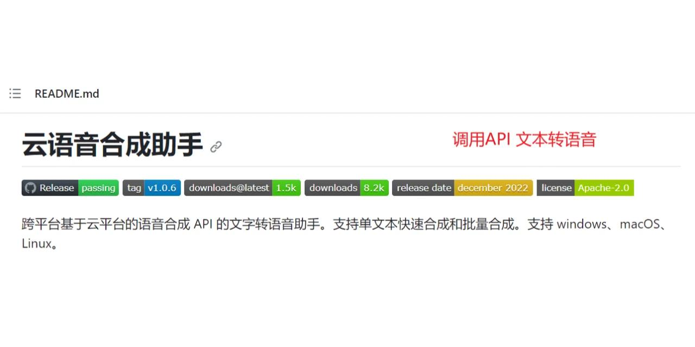
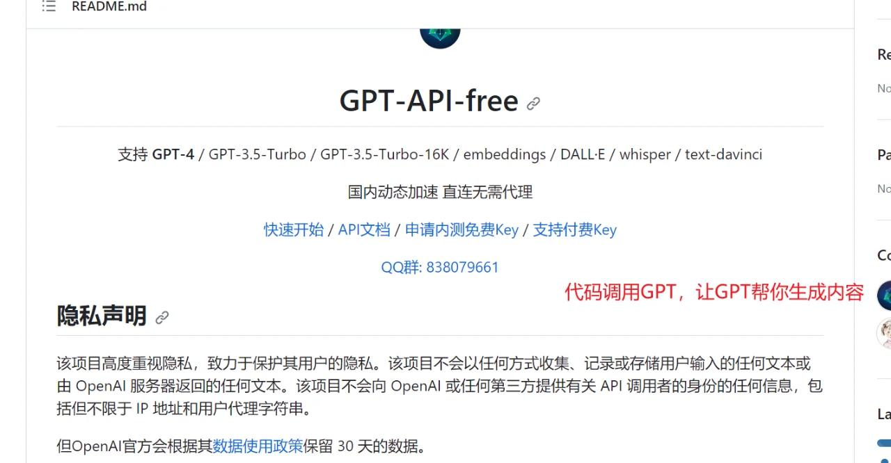

# 打工人手册#18 免费的方案

 

 
有这么两句话，今天我先免费送给各位。各位要是能看懂，也算是大道渐得。
为什么，软件代表着高效？
源码之下，了无秘密。

上面这些我以后还会掰碎慢慢讲。
今天我们聊解决方案。前面我们提到了诸多东西，有道法术器。今天我们来聊一聊把无数个器以及术包装起来的东西——解决方案。

什么是解决方案？你会算账，你懂一点法律，这不叫解决方案，能从零到一给把公司搭建起来，这叫解决方案。你会代码，会图像识别，会制作小机器人，这不叫解决方案，你能针对对方公司，直接造一批符合对方需要的机器人，甩对方脸上。然后和他说，哥，你要的机器人好了。你们效率可以提升多少，成本可以降低多少。这，叫解决方案。

解决方案很宝贵。很多时候，我们说学习知识要闭环，为什么呢？就是因为单独的知识不产生价值，一个完整的解决方案才产生价值。

这么有价值的东西。那这样，解决方案一定卖得很贵吧？那么，我要是告诉你，有一个地方，解决方案，直接挂在网上，白白送给你呢？

那就是...(知名不具)

git hub用法见图一后内容，一定要往后滑。