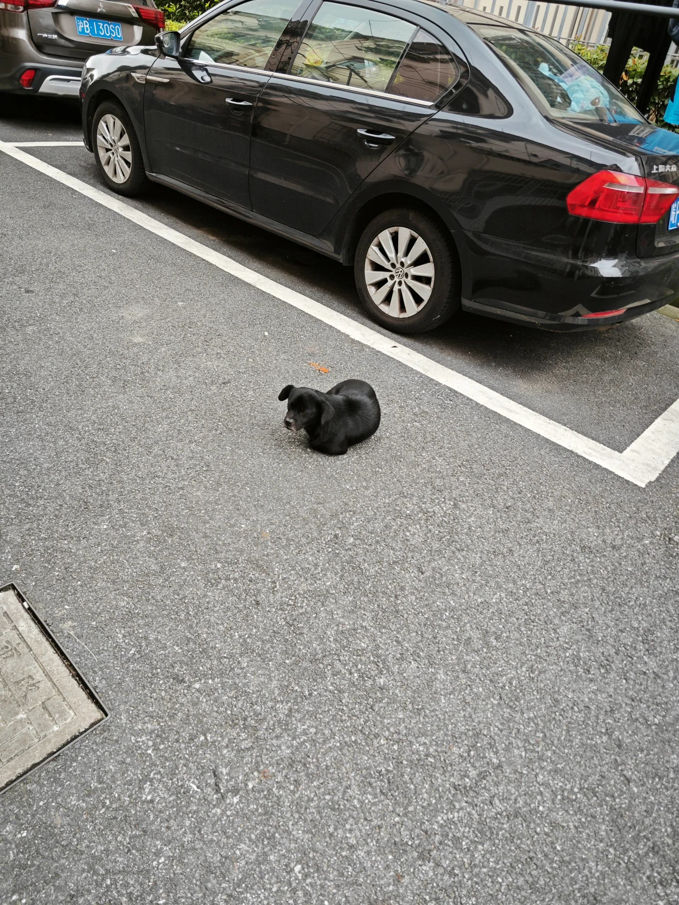

# 打工人手册#23 忙到无暇关注其他事情

 
 
职场最危险的就是忙碌。
即便忙碌，也要化忙为闲。

事情卡住了，那就卡住了。你千万不要拼了老命把进度跟上，然后再努力的去说自己有多忙。何必呢？
这种事后的努力说忙，还有被别人说的嫌疑。别人想，你这也太爱自吹自擂了。
不需要这样。

事情卡住了，你付出你的能量去推动，但是做事情也不要着急。一点点来，做好份内的那一部分。就慢一点，不要说不行，不要说难，不要疯狂去催促。只说确实需要更多时间，问题确实很多。这些嘛，都是客观的。

日常的事情，该做做，该向上管理，该摸鱼的，甚至大需求没做完，搞慢点，搞点小活，都是很正常发。到点该下班下班。

不要希望完成所有事情，然后再慢慢利用职场时间干别的。当前虽然忙，但也可以干点别的嘛。