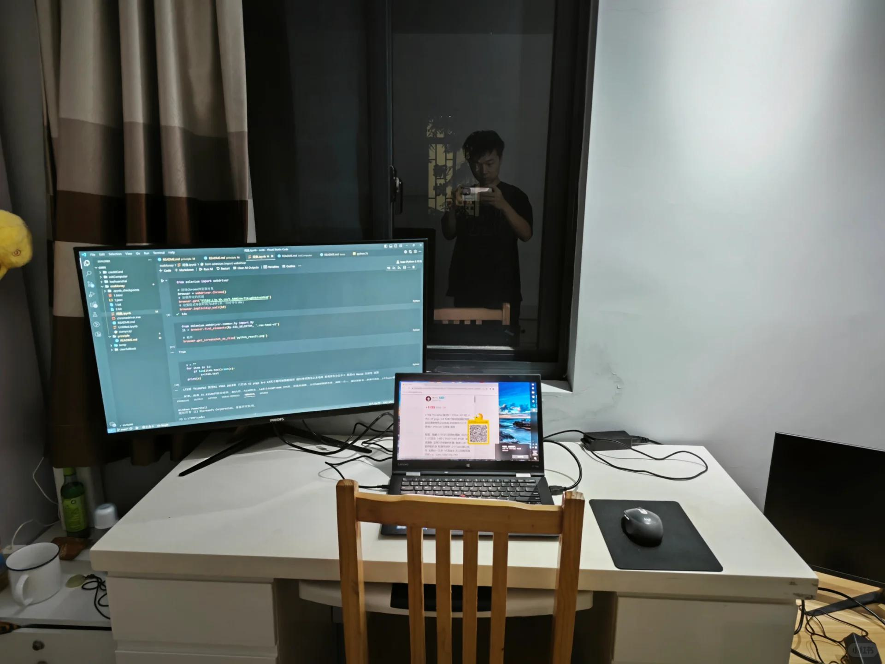

# 打工人手册#3 输出功率

 
 
为何我们大多数人，除了工作之外，少有所成。
这儿的少有所成是说，除了工作之外，没有赚到其他的钱。
为何呢？
我们投入其他事情的时候，总是有一时间的热情，一时间投入了半个夜晚，半个早晨，然后项目推进了很多。

例如你自己做一个淘宝网店，做这些差不多等于你把店铺建好了，第一个商品发布上去了。
又例如你写代码，差不多等于你把架构图画好了。

但是，最大的问题就来啦，那就是，只有输出的最大功率。没有平均功率。

认真为自己做一天事情的人多，为自己干一周，干一个月的人，少。
保持你的平均输出功率。