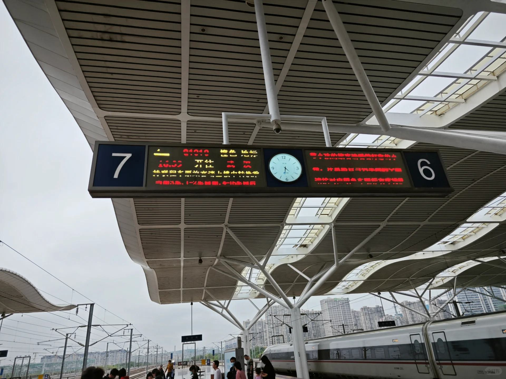

# 手册#36 最伟大的亲情

 
 
想做点什么，真的难。
人在外地，有工作，时间都泡在工作上，触手可及。
想要置办的物业在家乡，遥远难以掌控。
没跑过盘。第一次跑。钱我出，时间我出，到最后，还要花心思，说服父母。
什么是说线做泪啊，这就是说线做泪。就是哪怕你已经怀揣着百来万了，你还要努力去调动每一根神经，去说服，去争辩。

所以，没有独立跑通的事情，不要交给父母，不要让父母参与决策。你去做就好了。
我已经算家庭建设非常好的一个孩子了，但即便这种情况下，奢求父母主动去突破，去抗事情，仍旧难以实现。那些家庭建设更差的人呢，岂不是做事前，父母都要成为阻力？

说这么多，不为了抱怨。
而是想提四点：
一，父母是最爱你的人，要好好对他们。一旦他们赞同了你，也是最支持你的人。
二，即便是天下最伟大的爱，也伴随着巨大说服的成本。
三，没跑通的事情，先不要借父母手参与。例如跳槽，先不与父母商量，可能更好。
四，说线做泪很苦，但你其实不会因此失去任何东西。