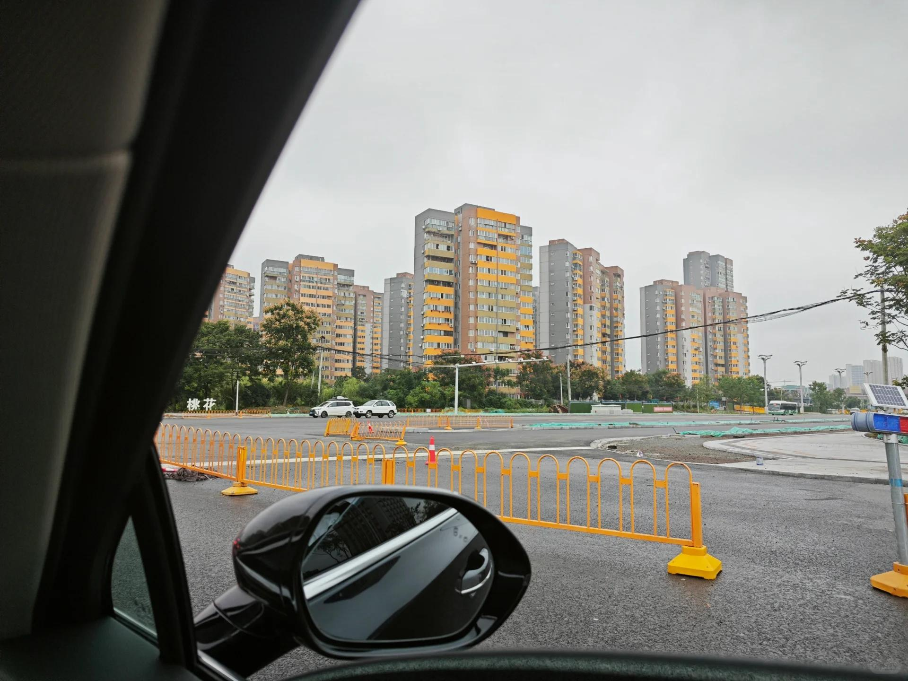

# 打工人手册#37 小公务员的苦楚

 
 
若干年前，莫泊桑写了一篇文章《小公务员之死》。
内容不大记得了，只记得一个字，怕。
一个公务员弄脏了一个上流社会的贵族的衣服，后面在恐惧中渡过了一生。

苦啊。
还有什么比这更苦的事情么？
但是天下还有比这更令人觉得可笑的苦楚么？

莫泊桑不知道，即便过了三四百年，有一群叫中产阶级的人，还是这样。
怕领导批评，怕同事指摘。
前怕狼后怕虎。怕得真实，怕得很容易让人共情。
但是这也是最可笑的害怕，因为这种害怕都是自找的。

你怕什么呀你，还有那么多事情要做，那么多钱等着你赚，你还这着舔舐伤口？裹足不前？去做事，开拓新的赛道，去构建新的机制，这才是最重要的。