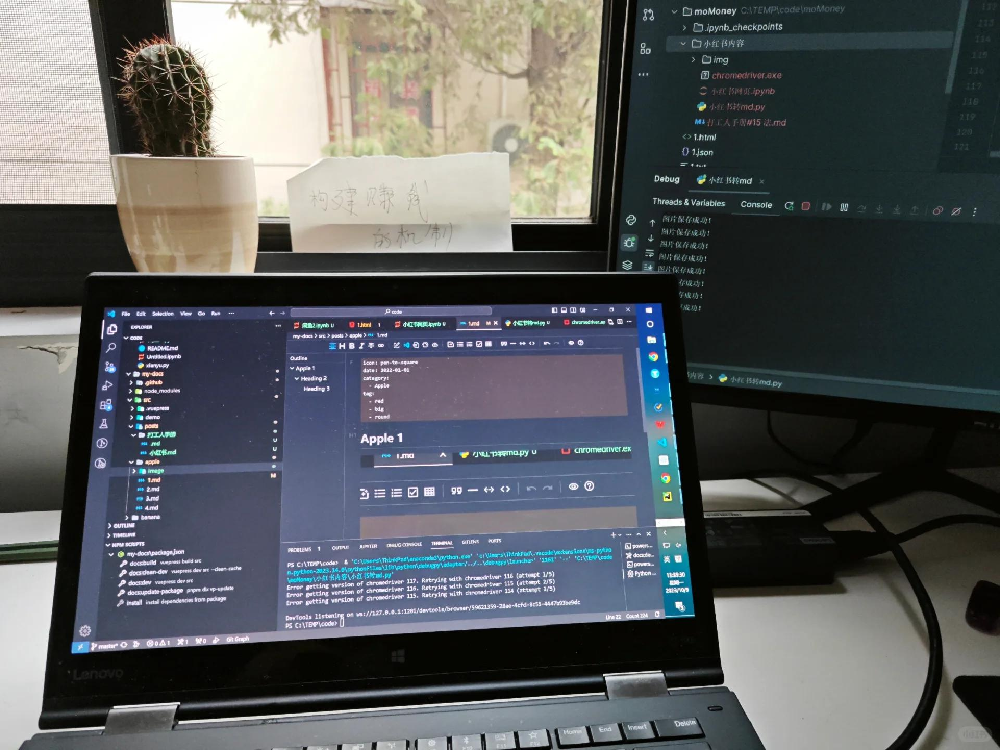

# 打工人手册#38 扫平前行的障碍

 
 
日常做事情，是有很多卡点的。
例如这个操作很耗时；那个操作一有点不理解；或者这个设备总是出了些故障；另外一个材料，每个月都需要月底手动花一天处理。

这些都是卡点，都需要解决。
有一台机器，或者一个系统，故障率是5%。那就是你使用120分钟，系统会故障6分钟(120*0.05)。
实际故障并非一产生就能解决，可能这个故障是因为螺丝松动，或者某个特殊情况而产生，你需要把机器重启，或者把数据手动恢复。这一来一回之间，预估需要*3倍时间，即18分钟，即故障率虽然只有百分之5，但实际造成了15%的时间占用。

15%占用，已经算是很高额的占用。此时，你应该放下手头的一切工作，优先去把这15%的时间占用解决掉。

然后再去做事。
扫平前行的障碍，才方便前行，这便是效率之道。