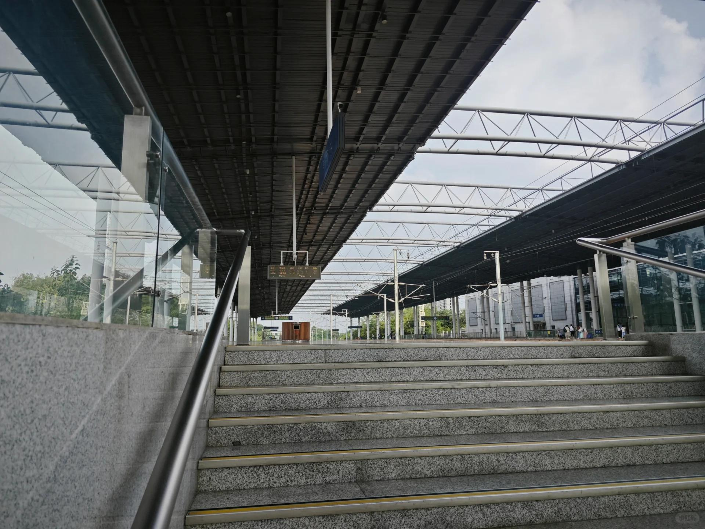

# 打工人手册#39 时代的六万五

 
 
本文又名，试错的成本。
为了试错，我已经花了多少钱了？
昨天打开电脑，纸和笔，一算，花了六万五了。
这笔钱很多，我打工赚回来，也要花费点时间。我的钱亏在，基金，价值投资，问题债。房产投资我刚开始搞，还没入局。其他小淘宝店等，没大力投入。自媒体现在还没入局。

这笔钱也很少，很多人第一轮开店，这笔钱也就亏掉了。

知识，用真金白银学习。大家都无话可说。有些人亏了，一转身重新投入到正确的事情上，并依靠此基业长青。
有些人亏了，丢失了全部本金，无翻身的机会。

我付出的这笔学习费用不算高，但也已经不少。

思考有三：
1. 灰度开量。哪怕一个事情你觉得正确，你也要一点点扩大，一上来就大搞很危险(例如高投入创业)。
2. 及时校验。事前论证，事中检验，事后复盘。现在看起来，事中检验是最容易被忽略的。
3. 克勤克俭的重要性。不说了，我先吃他几个月馒头吧。