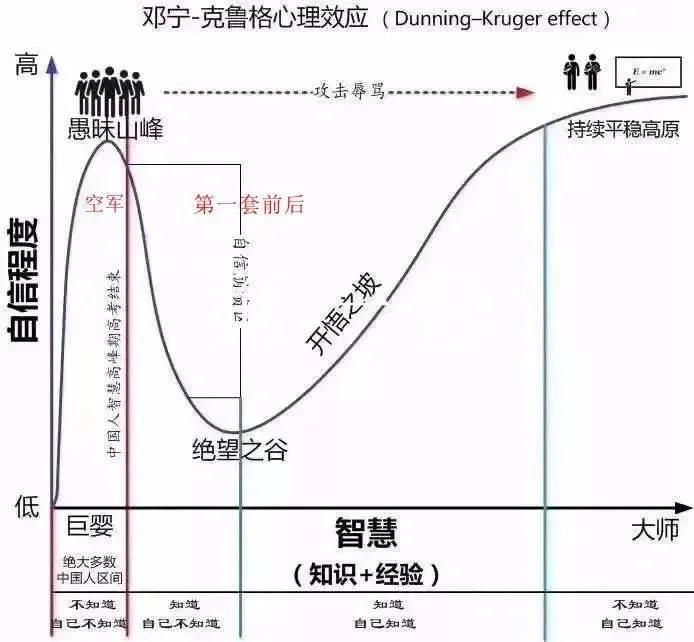

# 打工人手册#40 斗志

 
 
生活，职场或者其他任何一切都是这样的，你想做点什么，结果进二退一。
进了两步就退回一步，甚至有些时候，前进两步连着两步都要退回来。

到最后你四下看去，做了不少事，但最后只剩下一个机制的空壳，还是没有跑通整个环节。

难难难，这就是做事之难。
当你付出的努力被抵消时，当方向被论证其实没有用时。你怎么想？

有些人沮丧，有些人放弃，有些人心想：你看，果然努力和和不努力的区别很小，最后我的收入来自于打工，他的也来自，没有区别。

还有些人只颓废一天，然后就重燃斗志。他心中想，通过试错，其实已经知道了取胜之道。剩下的，只是如何尽量分配时间，完成他。