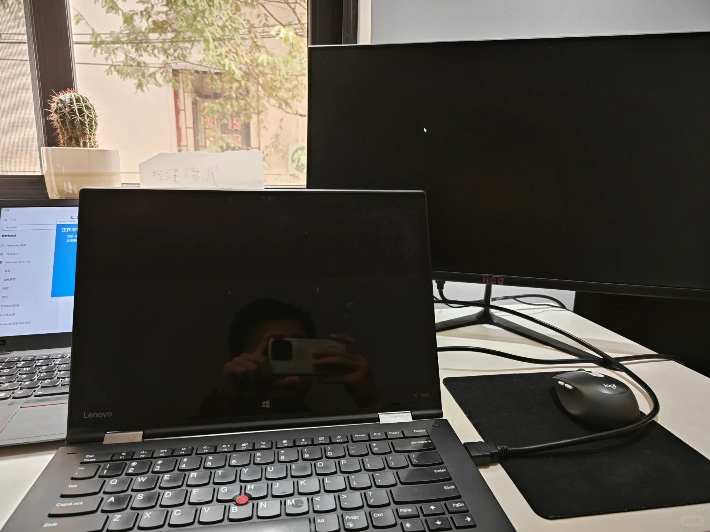

# 打工人手册#41 资源的极致利用

 
 
如何把资源利用到极致？
我不知道。我不是那么明白这个问题。
但是我能说上两句。
对于你最懂的行业，你天然的就是明白如何知道把资源利用到极致的。例如软件，你在这个行业浸淫久了，就能学会如何把开发的时间压缩到极致，如何把软件的性能提升到极致。

但除此之外呢？生活上呢，如何把时间利用到极致呢？
钱如何使用，时间资源如何使用，购买的电子产品如何使用，结实的人脉资源如何使用？
这里面，难道不是每个都有一个利用到极致的心法在么？

答案是，很难，你很难生活中每一个方面都把资源利用到极致。实际上也不需要，你想要突破，那就在重点方面，时间，金钱这两个方面，将资源利用到极致就可以了。
其他地方，不需要那么极致，有一个框架在，保证不会浪费到太过，就好了。