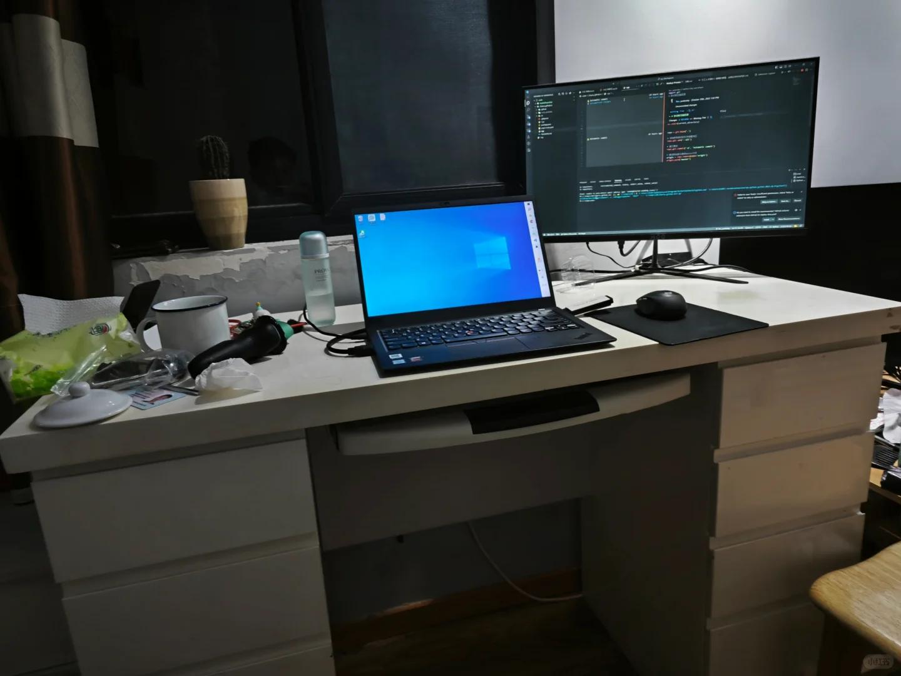

# #43 职场是消耗战

 
 
前面有一篇文章，说偷懒是一个系统工程。这篇文章还要说，职场是一个消耗战。

就像是汉武帝攻打匈奴一样。鼎盛时期的汉朝，做到了让胡人不敢南下而牧马。大汉在阴山(匈奴人的精神图腾)上举杯相庆。然而没用，你赢了，但是你赢得很惨。

职场无数地方都存在这种例子，你赢了，但是你赢得很惨。你堆时间，争项目，不断让自己提升，思考效率，拥有掌控更多全局的能力。做了很多事情，但是最后的收益也只体现在绩效上，再换来在年终奖上。
只有你自己知道，要表现好。其实并不容易，不断思考，平衡进取与同事关系，也不能抢了上司风头。职场是这样一个阶梯，你发现有路可以攀登，于是赶忙爬上了这个阶梯，也确有所获。但是很快你就发现，这是奴役之路。

如果无法官升一级，或者升官的速度慢于你消耗的速度。你就是在打消耗战，多年以后，蛮子会卷土重来。你的胜利和财富不过是当下的虚影。