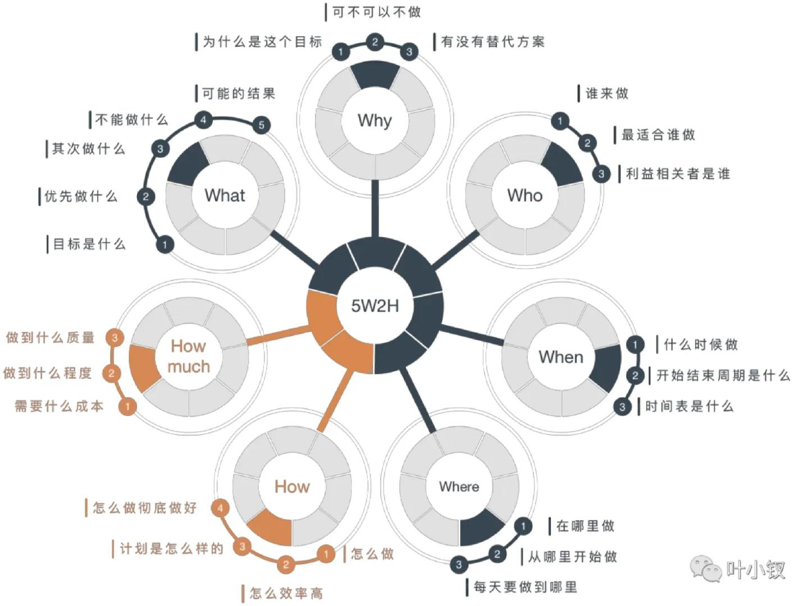

# #50 脑子为谁工作

 

 
身体在为谁工作，为了公司。脑子在为了谁工作，还是为了公司。
一开始你只是想出卖时间，获取财富。到后面你发现你把八个小时之外也卖了，脑子中总想着公司的事情，方案下一步怎么推进，哪儿有什么卡点。

智慧是有限的产物，需要时间来沉淀，而且也是用一点少一点。虽然可以不断壮大，但有限时间内，这儿多分配一点，另外一个地方就要少分配一些。

你把你的脑子都替公司想方案，为公司的自动化，赚钱机制不断进行思考。为今年公司给你定的okr不断思考，那么你自己的事业呢，推进了多少？最后你能从公司带走的只有两样：钱和经过公司事情洗刷过后的脑子。

多为自己工作，多为自己的生活卡点想解决方案。想一想如何利用公司资源，让自己的脑子得到更加全面的锻炼，利用公司的时间，思考自己的机制构建。自己构建的机制，你是能用一辈子的。
采得百花为蜜后，为谁辛苦为谁甜？