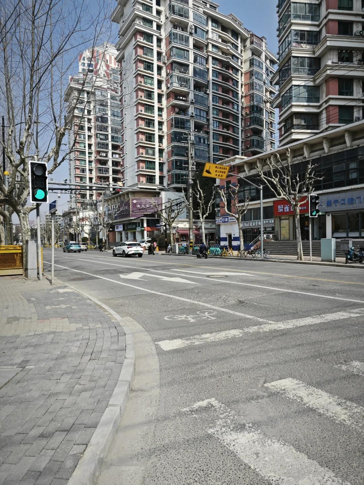

# 打工人手册#57 命运的拐角

 
 
分歧让人选择，选择让后续的分歧会越大。众多的命运线成就了社会这颗大树。
很多时候会感觉自己来到了命运的分歧点上，选择A择选择一种生活。选择B又是另外一种生活。
内心的火种不会熄灭，想要实现的梦想刻在心中。夜晚，有时陷入麻木的白天，我内心的渴望在回响。
那是呼唤自己去创造更大一番事业的战角，也是时刻提醒自己做好风险控制的警钟。
勇者总是先踏上旅程，然后成为了勇者。