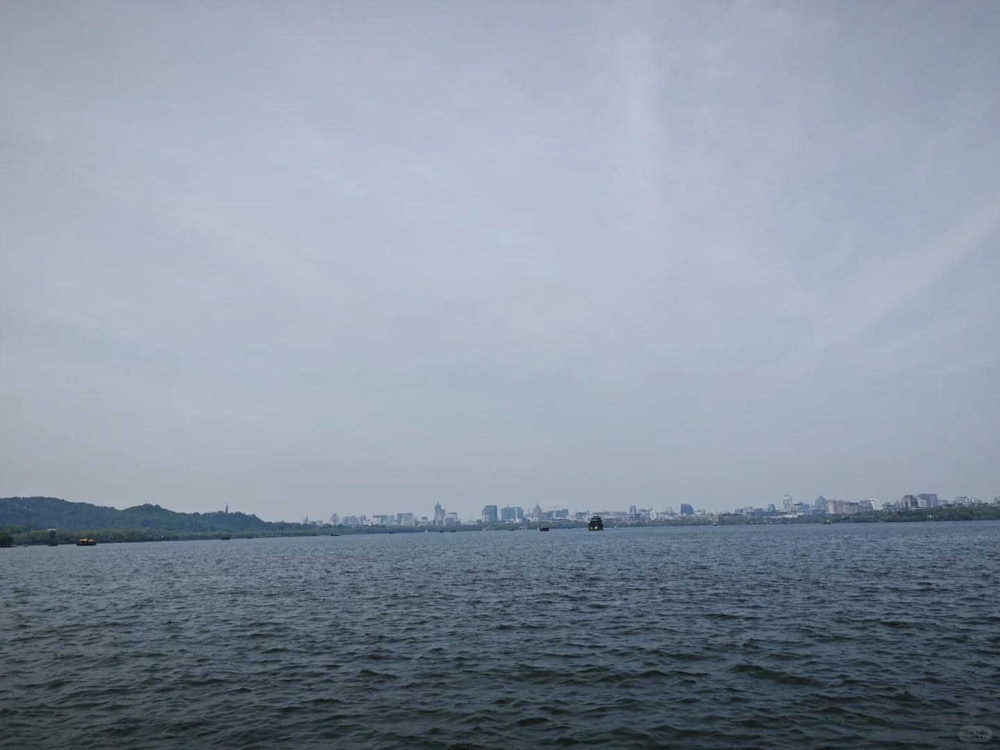

# 打工人手册#58 资源的解锁

 
 
资源一定是一步步解锁的。
 
你能力很强，但是今天让你去收个废品，你短时间内一定是收不明白的。城市里哪里有废品回收站？哪里高价值废品比较多？自己要捡为主还是收为主？能不能跳掉这些小的回收站，自己对大回收站？能不能自己开个回收站？
 
这些，你没搞过，光凭脑子想是想不明白的。但你到里面去搞，一两周就能摸明白。
很多隔行如隔山，恰恰是因为不在此行之中。
当然很多行业其实也没有必要入，如果要学武，自然要学天阶功法。如果入行，自然选择能成神的行业(科技树的终端，有超额回报)。
而锁死一个人科技树的最好方式，就是锁死他的时间。