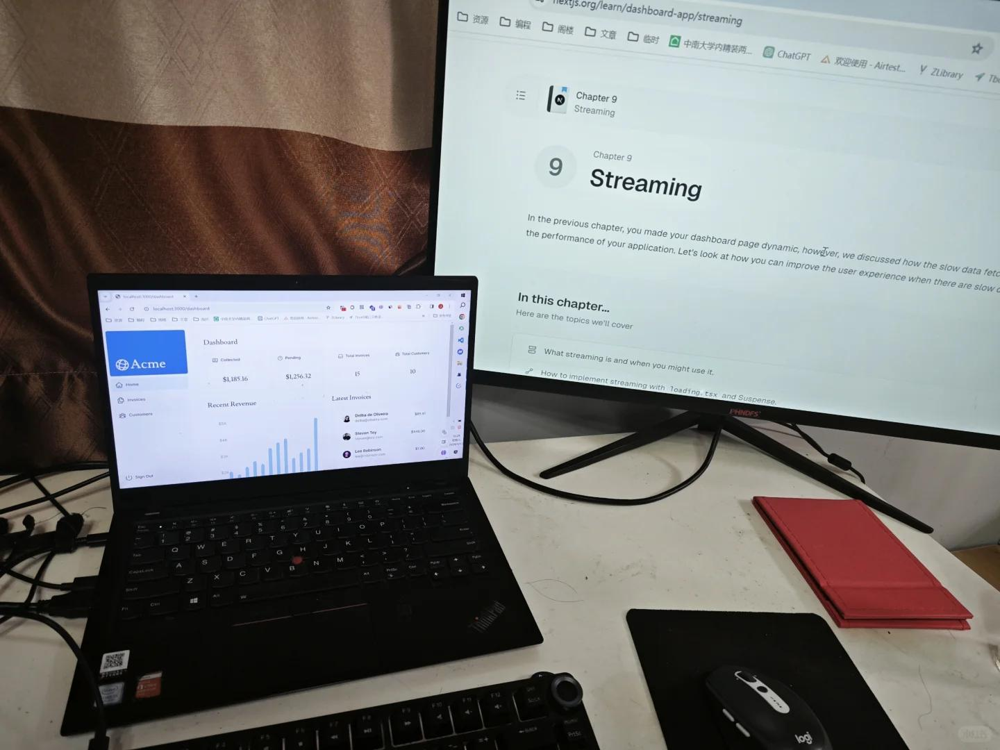

# 打工人手册#59 靠专业赚钱

 
 
你以为你是赚的什么钱？运气，大势？不，本质上都是赚的专业的钱。
你足够专业，才能赚钱。
不论写代码，ppt，设计，还是股票，投资。
 
你以为你赚的是运气，是行业？或许有人说，谁谁谁运气好，进入了一家上升的公司，赚了很多股票。然后高位套现，后面就脱离了基本都生活约束区了。
后面自然也是突飞猛进赚了更多的钱。
 
这个描述有两个巨大的描述误区，首先，难道这个能上升的公司，不是自己选的么。在公司里的站到浪头的技能，不是自己选的么？其次，高位套现，不是正确的抉择么。出来开创事业，中间吃过多少苦头。亏光的只怕不在少数。
成功的最终才成了你面前看到的样子，吃到了时代的红利。但是时代的红利就在那儿，任何人都可以去把握，去抓取啊。
怎么选本身，就要求你足够专业啊。选择后，能否每个环节比别人优化1%，也要求你足够专业。
 
专业，才是赚钱之根本。