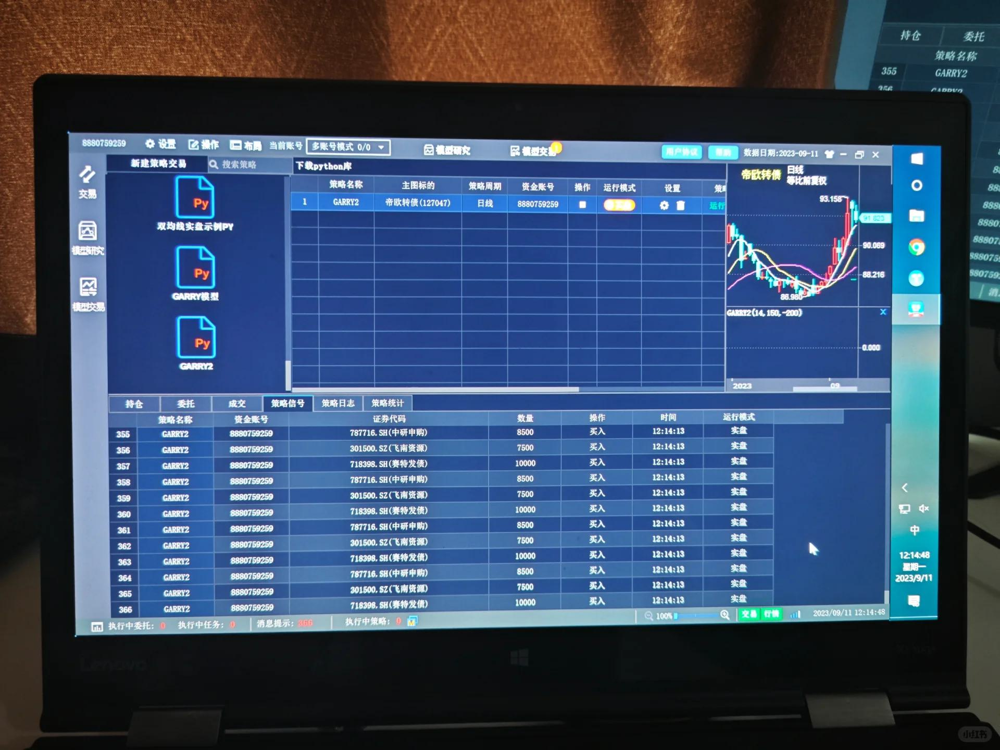

# 打工人手册#8 大有大的难处

 
 
大有大的难处。
真大起来，才会知道，这么多东西。

更大代码仓库，不是你一人能管理得过来。
更多的卡，你划拉划拉，都需要花费不少时间。更大的公司，连电费支出你都不可忽视。大了，因而就没那么精细化了，资源利用率低了。管理没那么贴近了。管束也多了。你5个人的公司，50个人，500，5000个人。到5000个人，吃喝拉撒，火灾，社会民生问题，也就都成了问题。

哪怕更多的钱，你管理起来，也和少量的钱，完全不一样。