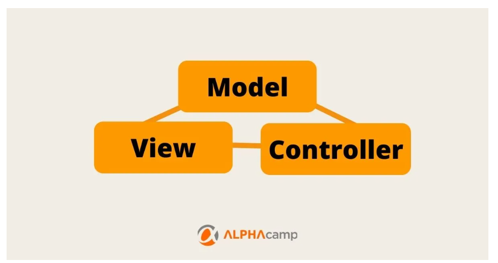
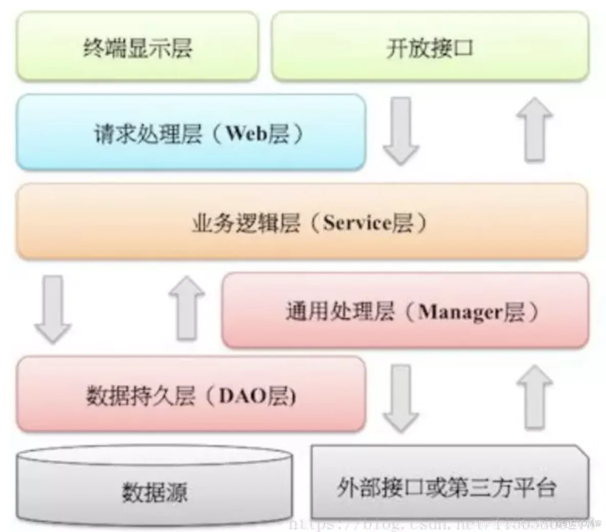
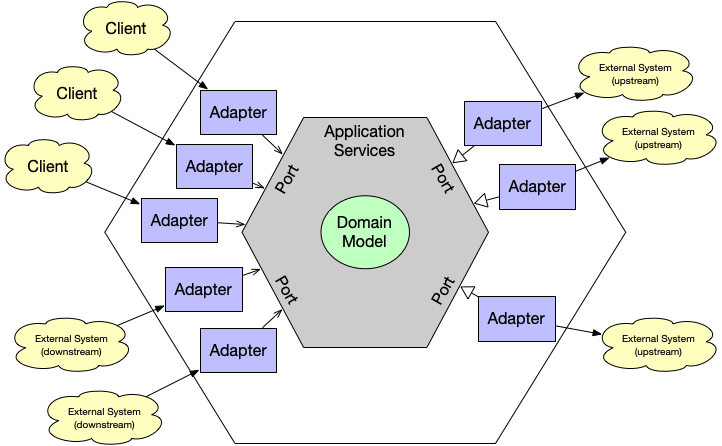
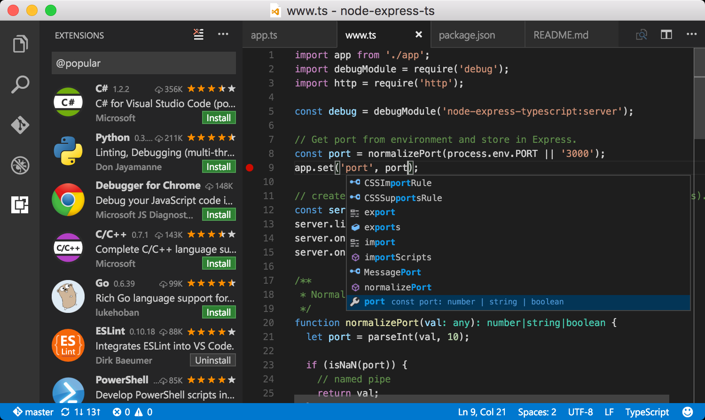

# #1 趋于混乱的代码

> 生命，以负熵为食。

本文从熵的视角谈一谈对生活中一些事务的看法。

## 代码趋于混乱

代码是天然的趋于混乱的。我想用软件界一些常见的思维和词汇，以熵的视角来谈谈这个问题。

### **面向对象：用对象来解决混乱问题**

面向对象对解决混乱度提出的解决方案是，将行为和数据赋予给对象。进而，有更加清晰的语意，并且代码也是天然分散的（不要小瞧这点，这很重要）；行为也会在更加适合解决它的那个对象中解决。但是，**随意命名的对象**，**对象之间彼此不必要的耦合**，导致了代码还是很多，混乱度还是很高。

* 此阶段的负面设计：
* XXXUtil满天飞，每次Util的出现，都是对象行为抽象不到位，API设计不合理的体现，过多的Util会让你的代码逐步向面向过程滑坡。
* java过于复杂的I/O读取，我只想要一只香蕉，但是你一定要先new一个森林，然后在森林中初始化一只猴子，然后我才能获取猴子手里拿着的这支香蕉。
* 对象抽象不合理，考虑场景过少，无法替换，只能做@Deprecate

有人提出了MVC，多层架构，逐步有人将这些架构抽离成为更加凝练的六边形架构，我们可以在架构层做一些事情，让我们代码天然的分层，每一层解决每一层的问题。

一个标准的mvc架构如下：

一个标准分层的架构如下：

六边形架构：

这些都是久经沉淀，逐步形成的架构，可以说是不同业务场景，不同业务量级下的最佳实践。

此阶段的负向设计：

* 贫血模型，频繁且无意义的多层之间互转。
* 过度的粘连层，体现在对covert的过度使用，内部各类也频繁进行黏合。

DDD则是意识到，在面向对象场景下，不论你架构设计如何合理，如果你对象本身设计不合理，必然无法解决熵的问题，反而会带来无穷无尽的新问题。

所以DDD强调，领域抽象，也不足为奇了。其实是将目光放在更好解决类关联的问题上。

### **Spring出世：IOC模式下的熵[logn*n->logn]**

这一阶段，Spring等优秀框架推广了两个重要思想：

* 依赖注入
* 控制反转

对于调用方，这简直不是熵减，而是彻底解决了各种厚重的粘合层；不同集体，不同代码开发者之间的问题，比接口更加彻底。例如各个中间层，最好就要能做到让外部自助使用，如果能彻底用依赖注入的模式改造，让服务可自助，效率提升会几何倍。

其实除了常见的spring开发使用了较多该思想之外，插件模式，也是该思想的熟练运用者。

如何维护若干的，彼此之间独立的插件：

插件模式适用于流程固定，插件之间属于彼此平行的关系。

另一种模式是流程引擎。如下，对于不并行的问题，混乱度得以巨大的解决。（原本由各自管理，变成抽象为配置，由流程引擎管理）

[https://liteflow.yomahub.com/](https://liteflow.yomahub.com/)

### **微服务：服务拆分直接从代码量级的角度降低复杂度**

微服务引入了很多问题。但也解决了很多问题，其中很重要的一点，现在，大家再也不用面对动辄四五十万行的代码了，如此巨大代码，开发时的冲突，对其他内容的干扰。进行服务拆分后，可以拆分成3~4w行的一个个小的服务。

这，就是巨大的复杂度降低。
