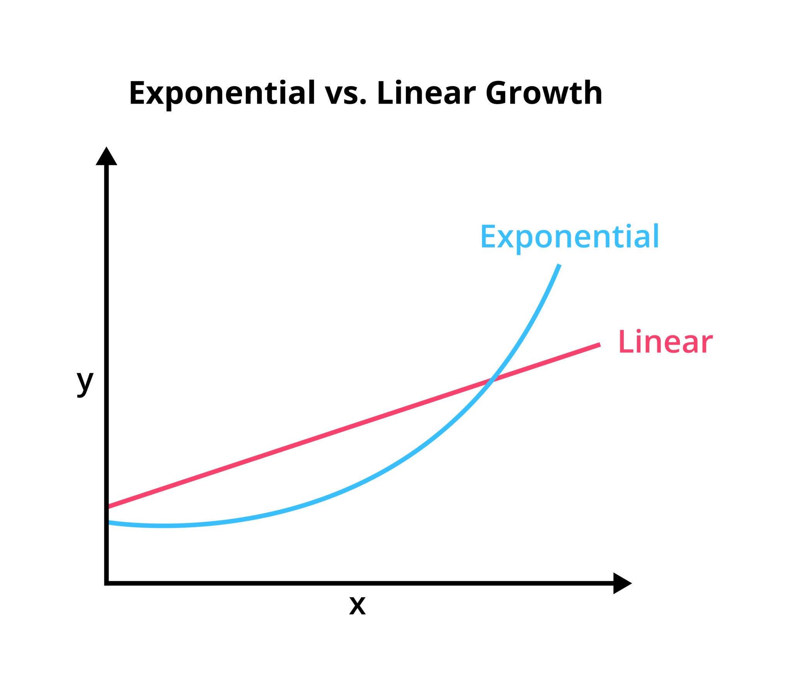

段永平说，做正确的事，然后才是正确的做事。堆砌做事的数量N，至多只是线性收益。很多时候我观察到是亚线性收益logN。而做正确的事，多年以后回看，会发现是是超线性收益exp(N)，所以大家不要瞎卷了，做正确的事，然后和时间做朋友。我已经去验证过了，确实是这样的

--

这也就是两种增长方式。

一种是+1，+1；另一种是*1.1，*1.1。

假设起点都是1。

那么，计算上来说N=39的时候，线性模式=40，指数模式=41.14，对线性模式完成了超越。并且一骑绝尘，远远超过了线性模式。

这也就是为什么要做对的事情，而不是把事情作对。也就是为什么要复利。N的含义其实就是周期，或者说迭代次数。

对于职场来说，这个周期是一个月（发薪日）。对于构建机制来说，这个周期是，一次迭代。

也就是，指数模式受制于起点低，一开始增长比较慢，但即便是再慢的指数增长，例如*1.01的指数增长，随着迭代次数增加，也会超过线性模式。

做对的事情>把事情做对。

所以说，我们要选择指数增长的曲线。

线性增长的人，只能去多加班，多增加时长，出卖健康。

而指数增长的人，核心要保证可持续性，因为越是后期，增长越多。当前的一切都甚至显得微不足道。所以要注意休息，注意健康，work life balance。

你看了上面的分析，也决定坚定的走指数模式。对，对么？

错！你仔细看一下曲线，你为什么不能先走线性增长，然后走指数增长呢？也就是先打工，线性增长的曲线超过指数的曲线之后，我再切换！先打工，后创业。打工赚取固定积累，创业获取指数增长。

OK。上面这个模式肯定已经非常好了。但是，但已经是最佳了么？答案，错！

还有更好的方式，就是指数曲线的斜率超过线性增长的斜率之后，你就应该切换！

逐步的进行这种切换，有一段时间可以平行的双跑。斜率超过的点是在什么位置呢？N=25！

也就是说，在N=25的时候，你的副业/公司收入，已经等于或超过你的职场所得，此时，进行切换。这个过程会比你想象的要早。你不应该等到N=39的时候再切换！

切换也要时间，并且，总有一段时间你需要双跑切换。

对我而言也是如此，一个月2.5%的波动就对应职场的全部收益了。职场再怎么卷也比不上chilun多赚2.5%重要！！！安稳的赚取这个alpha比一切都重要。

结论：指数增长比线性增长快得多。指数增长下的思考模型，完全不同于线性思考。斜率超过时，你就要转向指数模式。
