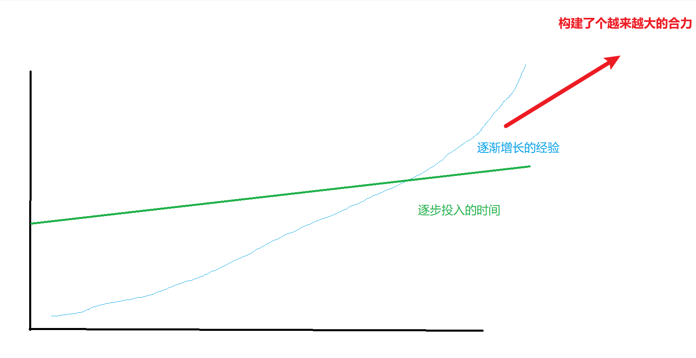

## #9 根据地

没有根据地，就是流寇。

## 一、机制

从某个时刻开始，我就对于构建机制非常痴迷。因为意识到了，很多之前自己做过的事情，自己还会需要重复做。

而自己第二次做的时候，如果没有文档、没有机制，很多时候就需要从头再来一遍。

单独执行一次的代码没有意义，把代码部署到服务器，不分昼夜的进行，这就有意义。

这一整套，提需求，写代码，验证无误，发布，赚取商业价值，就成了互联网公司的工作流，也就是互联网公司最大的机制。

机制是这样的重要。机制其实是不依赖于任何一个个人的，不论你是写代码的测试，还是管理机器的运维。你只是这个机制中的一颗螺丝钉，是可以随时替换的。

对于个人而言，机制也是一样。有提醒的机制，有自动买新股的机制，有自动发布视频的机制，文章自动发布多平台的机制，互联网捡瓶子的机制。

很多事情做一次，只能赚取一次的收益，而且还要面临初次执行的高昂成本。

但是机制构建的模型成了这样：

> 总收益 = （单次收益 - 单次成本）* 执行次数 - 构建成本

这是大自然的法则，这是山呼海啸般的法则。

桥水基金达利欧说，构建机制是最重要的事情。代码天然是最棒的机制。

看了他的《原则》一书，我一瞬间像是被闪电击中，诸多过去没有洞悉明白的，过去没有形成方法论的，过去反复挣扎在泥潭，此刻终于顿悟。我爱上了构建机制。

## 二、为何还没有成功的机制

构建机制之路也不是一路顺利。有了新的看待世界的眼光，我在职场上做了非常多提效的工具，深远的设计。也获得了对应的回报。

生活中写了自动买卖股票的代码，日常生活中自我提醒的代码，自己搭建了能长久不会腐朽的网页。

**但是我还是没有走上快车道。没有体会到：**

> 总收益 = （单次收益 - 单次成本）* 执行次数 - 构建成本

公式的魔力。可放大，可衡量，概率这些咒语还是没有对我应验。

当然，一者是人的进步总是需要时间，对应主业工作繁忙的我，自然构建机制的速度会慢很多。尤其是构建机制最需要的不断不断反馈，不断迭代，这个少了非常多。可以我说不够勤勉，但是这个不够勤勉也是信仰不够坚定，阴阳切换中势必要经过的关隘。

二者是机制与机制之间也各不相同。只有真正关键问题上构建出来的关键机制才具有最深厚的价值。其中我的思想也是逐渐被洗练的。

我们来画图说明这个问题：

逐步投入的时间和增长的经验最终会形成一股合力。最终形成撬动这难于撼动的巨石，而撼动了之后，巨石滚动起来了，就会好很多。现在关于构建机制投入的时间和理解，这两者应该都还在很初级的阶段。

## 三、流寇的灵魂之问

像是之前，我问自己，为什么这个年龄了，还没有发财一样。我们也来问自己，喊出：

> 用构建机制来创造财富

# #9 强与弱的幻觉

一年了，为何还没有构建一个值得称道的机制？可以以此谋生的机制？

答案就在于投入的时间，以及关于构建机制的智慧还不够。

生活中，我大多数时间还是用来进行一次又一次的非重复博弈，或者被锁在工作上，自然就没有时间构建机制。

另一个角度，是没有根据地。

连第一片田地都没有，任何根据地都没有，很多时候做起来要依赖外部的关键资源，没有自己的地盘（例如房子），没有自己的公司，没有自己的业务。

任何根据地都没有。这让我为谁构建机制呢？为什么业务来构建机制呢？

就好像，你短暂暂管一片区域，你难道能在这儿建一个水利工程呢？

水利工程，可能也就两三年也就受益了，往后无数年，都是正向的收益。但是作为一个流寇，你不行。

你构建的机制无处存放，帮公司想优化的点子，下一步该怎么push你还是怎么push你。

没有自己的家，你为出租房构造一个好环境总觉奇怪。

没有赚钱的业务载体，你优化多少代码的效能，都没有价值。

你就是一个流寇，或者说是一个大公司的雇佣兵。你单兵作战能力固然强大了，但是公司就是轻易的把你拿捏，因为你只要还被雇佣，你要吃这碗饭。就要乖乖投入时间。

你投入单次型业务的时间就会更多，你用来构建机制的时间就会更少。

## 四、后记

给自己打造一个根据地非常重要。

职场、自己的业务、自己的项目、自己的家里、社交中、伴侣。都需要一个根据地，根据地会源源不断的产生粮食，你在根据上，才能真正的构建出一些长久的机制。

不然所谓真正的机制只能是空中楼阁。

建设一个根据地要什么，你要一点点的，耐心的，仔细的把某个区域治理好，某段关系维护好，某个项目管理好。你亲手搭建的，或者民心向你，这就成了你的根据地。
