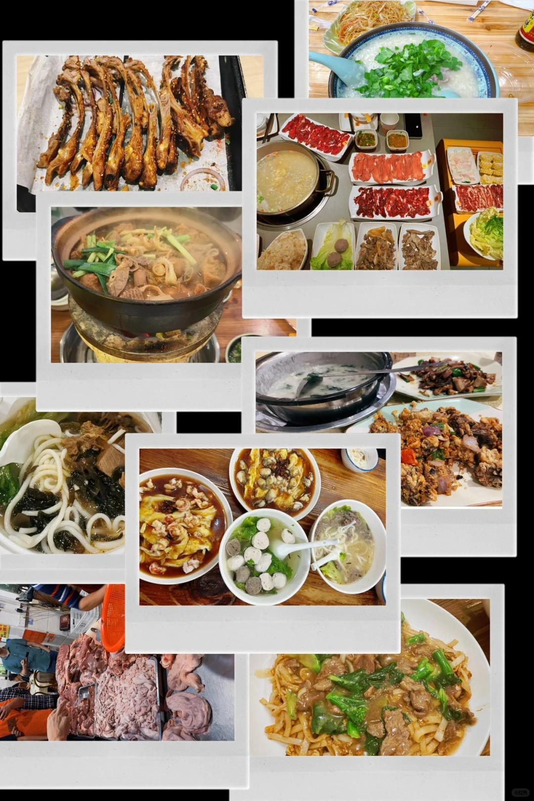

# 2023的尾巴来广州工作啦！打工人日常～

异动广州第一周，快要冻死了……
我的散伙饭刚吃完前组长也异动了
师傅也在，这下好啦，广州相聚了
第一天刚到俺师傅就带我去吃了标记！
猪杂粥吃了，牛杂煲吃了，羊杂汤吃了，
潮汕牛肉火锅吃了，粿条吃了，肠粉吃了，
生滚粥也吃了，米粉米线牛河也吃了
 
公司楼下的卡皮巴拉和圣诞树真可爱，
附近的商场都是圣诞节的氛围真好呀！
广东人夜生活真的好丰富！我爱了！
 
夜里下班后的夜宵&周六的改善伙食。
#周末吃什么 #广州 #打工人日常 #广州美食 #圣诞节