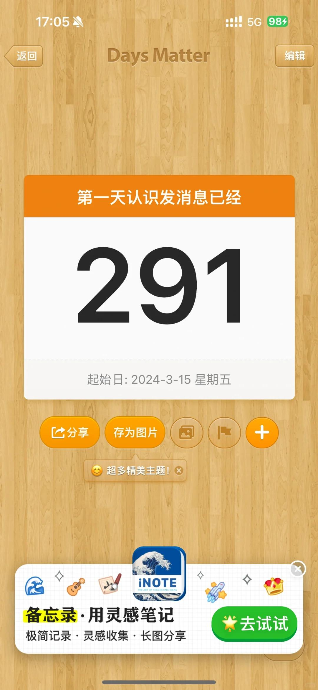
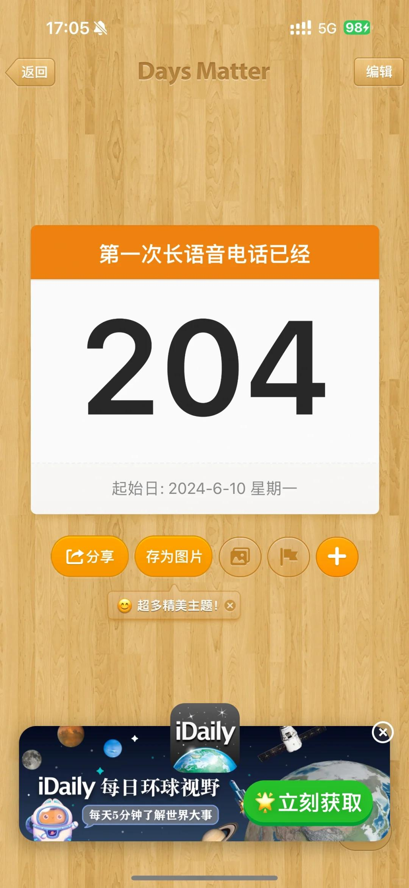
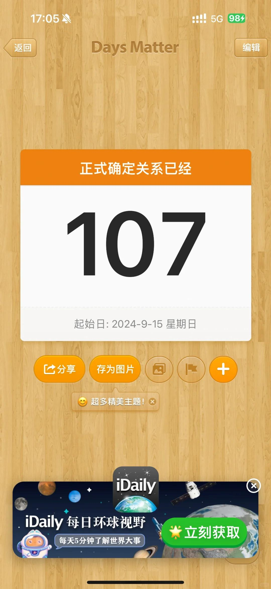
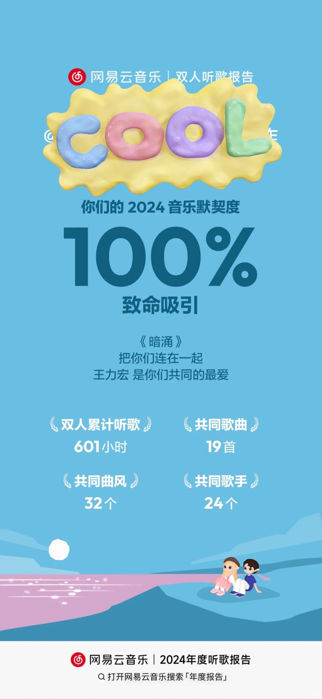

# 2024很幸运，2025会更好呀！

2024.12.31，眨眼间已经是2024年最后一天了，
2025，开启人生下一阶段，我们都会更好
3月认识，6月每天电话发信息，9月正式在一起，一年四季，已经12月啦，缘分真的是个很神奇的事情
虽然24年最后一天因为工作/异地/一天假等等因素，无法见面，但是男朋友3-5号会来深圳一起跨年
——————如此便也对未来畅想一下——————
 
【诚诚2024年的总结里，对2025年的展望原文为】：
2025，轻松自由。机制逐一构建。
职场从容自信，每天下楼走走，持续减少付出。
和对象琴瑟相和。
轻松自由着，也可以把事情给做了。关键在于思考，在于选择。
 
【那我呢，沐沐的2025年展望与之对应，如下】：
2025，轻松自由。享受生活，多休息多旅游多体验。
逐渐调整职场心态，更从容一点，增强打工人的“钝感”。
和对象和如琴瑟。
对未来的规划更多一点，对财产管理要更上心一点，做选择更勇敢一些。
 
额外需要多关注两个人的身体和心理健康
最后的最后，希望2025年我们感情会更好，诚诚and沐沐可以更多包容更多理解更多照顾，互相支持互相陪伴互相依赖，彼此信任彼此真诚彼此坦荡，逐步推进杭州的plan，最最重要的是一切攻取天下！
#异地恋 #恋爱日记 #奔赴新的一年 #这一年又要接近尾声了 #一起遇见更好的自己 #期待见面