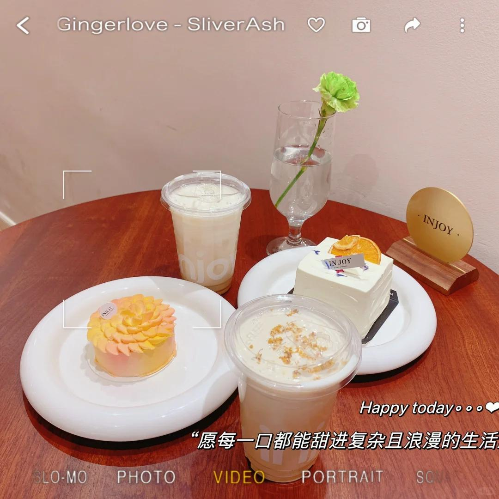

# 不要把你的观念强加给别人

遇到一个男生在跟我讨论感情问题的时候说：“我觉得你总有一个理想型，一些条条框框限制在，你觉得你真的能等到一个百分百匹配你的人吗？就算你等到了，他真的适合你吗？”
 
我说：“每个人都有自己的理想型，你挑选对象也不是阿猫阿狗都可以吧？都有筛选的条件才能有了解的欲望，性格外貌不都是？再者，我没有说非要百分百契合才可以且适不适合需要磨合才知道。也是你说得成年人只做筛选不做教育。”
 
真的很不喜欢爱教育别人的男生当然前提你要是有这个资本也不是不行，你有能力说服我。别拿你自以为是的那一套东西来跟我battle，每个人都有自己的坚持和喜好，先不论对与错，大家的成长环境不一样，接触的东西体验的人生不一样，形成的价值观念不一样，别把你的想法强加给别人，有些东西可以放弃有些东西不可以，尤其是原则性的～
 
那啥，我个人觉得那个所谓的“条条框框”是很基础的，且我身边很多朋友都符合可能你自己不符合才会来杠我吧～
#爱情
#感情
#普信男
#努力变优秀