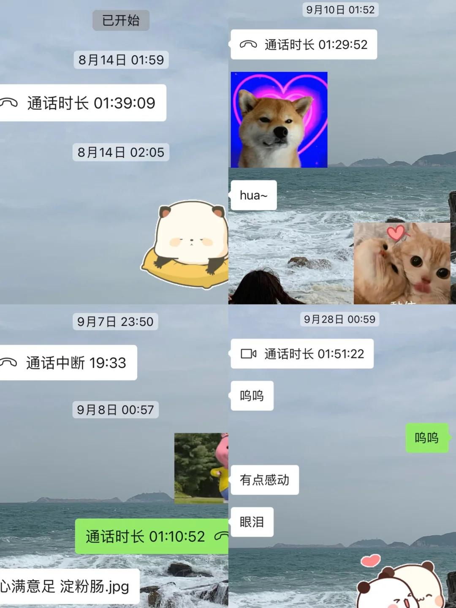
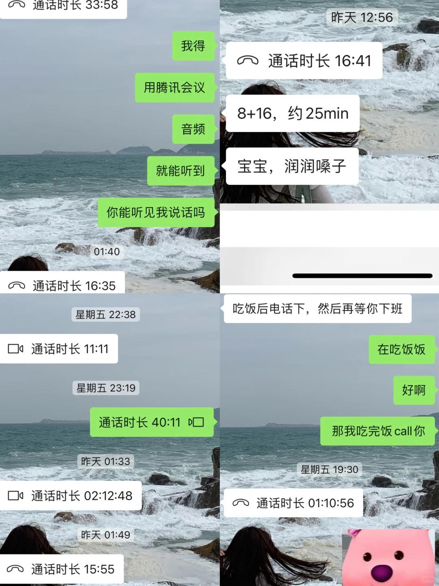
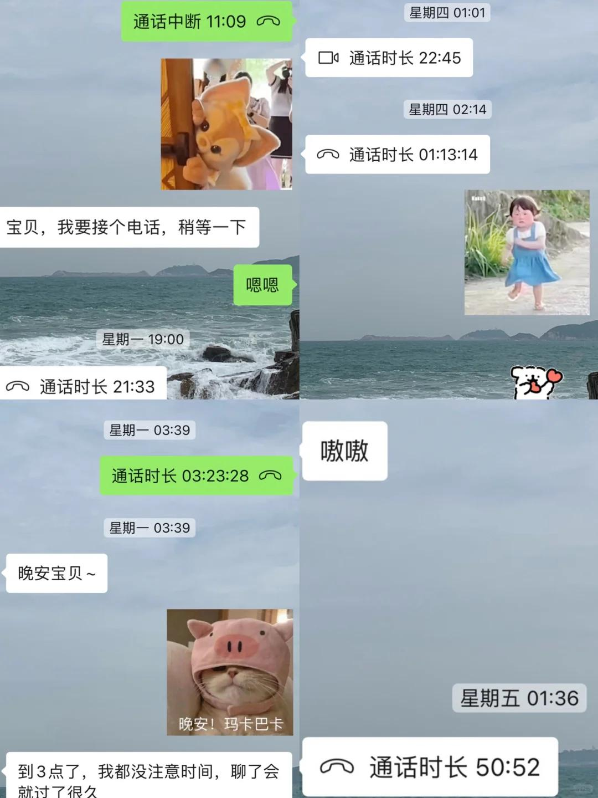
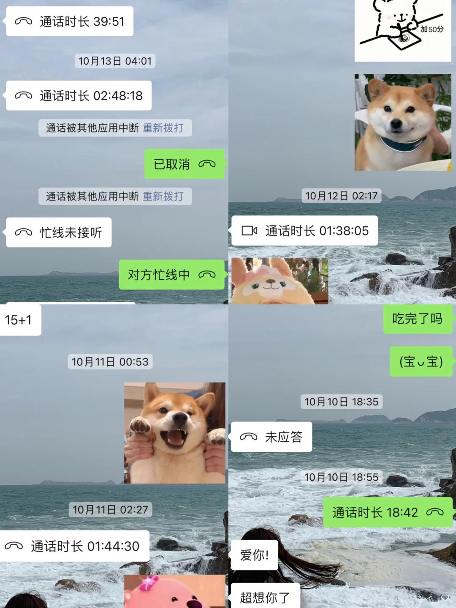
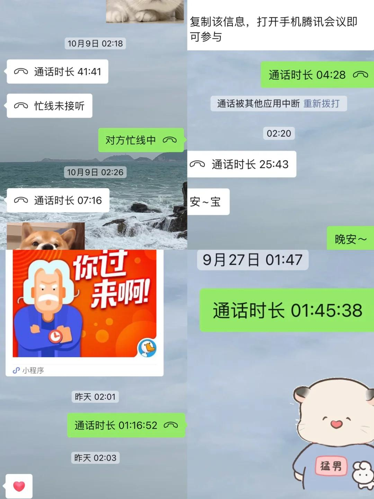
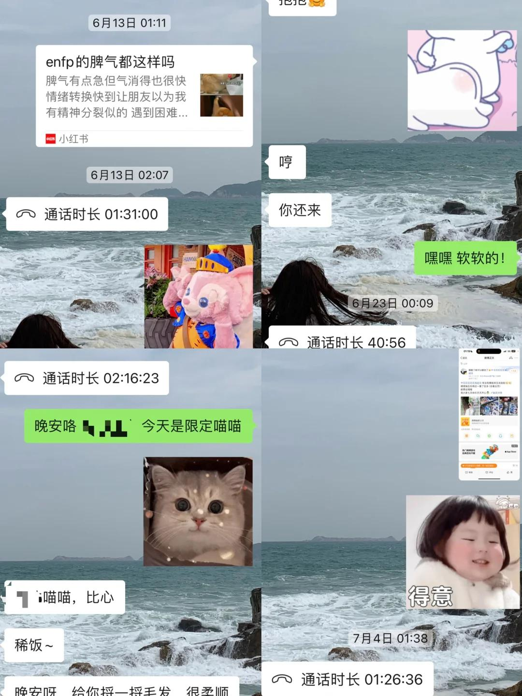
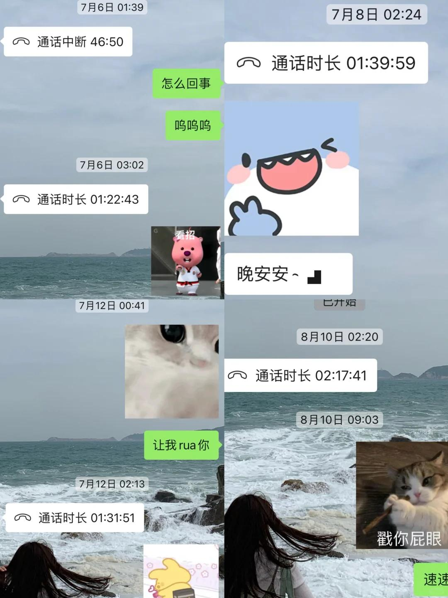

# 两个人在一起就是意义！！

两个人在一起就是最重要的、就是意义、就是经历、就是陪伴、就是幸福。☀️这个是男朋友今天说的话，戳中了我的心巴，很喜欢很喜欢～ (*¯︶¯*)
 
“异地恋怎么谈”“如何坚持/维持异地恋”“异地恋的意义”“异地恋需要天天打电话吗”...太多太多这样的话题，在没有遇到对象之前我也害怕排斥异地恋，隔着屏幕的感觉对方能真切感受到吗？但是遇到他以后，异地恋算什么！每天都好甜好快乐
 
我天下第一幸福，就是那个最配他喜欢和疼爱守护的，哈哈哈！！我不喜欢异地恋，我喜欢他超爱他，他也很爱我。他也说没有异地恋的感觉，很亲近！见面也没有陌生感，熟络的拉手手贴贴～
我爱用波浪号，男朋友被我影响跟我聊天也会使用，各种存我的表情包还嫌弃我好久不更新，哼哼
 
不在一个城市，那就每天从起床那一刻开始，朦朦胧胧道一声早安，开始分享自己的生活，让对方参与其中；诸如出门看到的事物、和同事聊天的内容、工作遇到的各种事情、一瞬间想法......好玩的好吃的好看的，都想告诉对方，第一个想到的就是对方。每天都会语音deep talk一个小时起步，每周间歇性视频，常常聊high到两三个小时忘了时间。【今天翻看了一下这段时间的通话记录，自己都被惊呆啦我们也太能叭叭了哈哈哈】
 
用腾讯会议一起玩steam游戏、一起通关男朋友早期自己做得游戏、一起学习讨论代码、一起看视频......男朋友总会想各种方式一起玩，研究新内容让我参与，找各种段子逗我开心，不得不承认在这方面他花得心思、做得事情比我多很多！(⁎⁍̴̛ᴗ⁍̴̛⁎)超级爱夸对方，从不吝啬表达夸奖表达赞美表达爱意表达想念～
 
“我们”这个词太有魅力啦，“家”因“我们”而具像化，charming、attractive。这个也是在男朋友的一次次表达中变得具体而生动，他说“我们要去xx看房买房🏠”“我们家里以后买这个电器洗”“以后我们也在家里做饭🍳”“要和宝宝走很远，陪你看各种风景🚗”“我会更努力，让宝宝更幸福”... 因为他，对未来我更加期待期盼期望，充满了无限的遐想和动力！！
 
已经买好12月去找男朋友的机票✈️给他过生日，接下来的日子更有盼头啦～嗷嗷，元旦一起迎接更好的2025，享受2025的第一个拥抱第一个假期！
#异地恋  #甜甜的恋爱 #恋爱记录 #分享欲