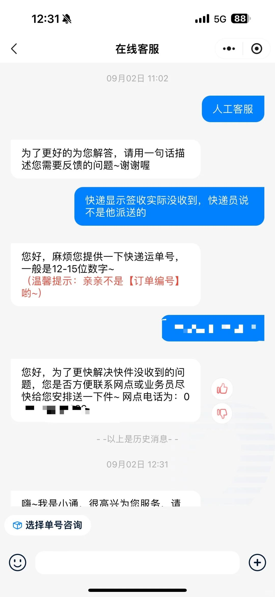
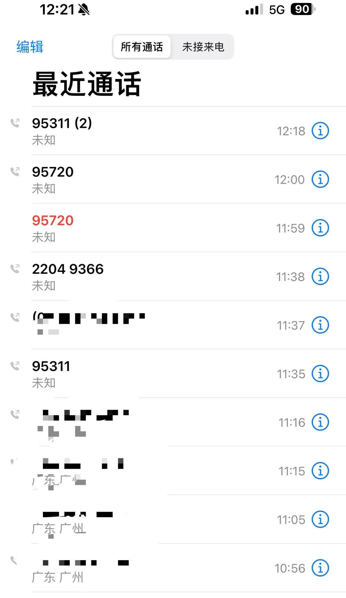
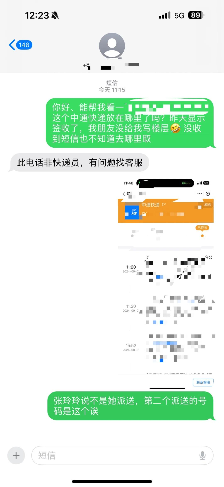
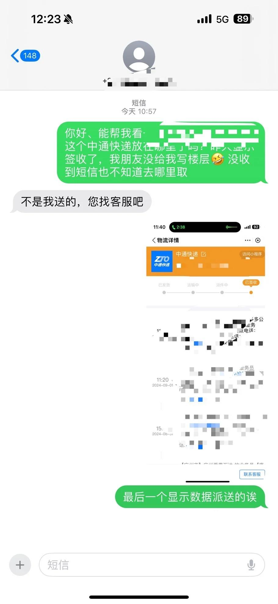
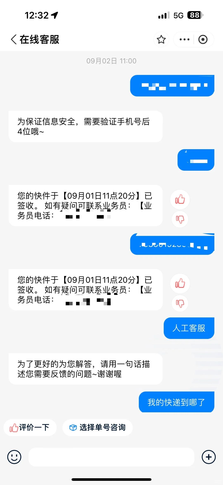

# 中通快递真的很垃圾！！！无语

快递昨天签收了，朋友给买的，我都不知道有快递，
没有电话联系没有短信提醒，还是朋友告知。
根本就没找到在哪，没写公司楼层快递间没有，
也没说放在快递柜自取，或者哪个驿站，啥也不是！
早上联系了显示的两个快递员好吗，跟我说不是他们派送的，找在线客服说显示签收让我联系业务员就是我发短信的号码联系网点电话根本打不通，响了三四分钟没人接听？？？
最后没办法打95720找我的快递，真的被气到了，又去打了95311投诉，一直不给我转人工说我咨询过了。我说！转人工，我要投诉！然后终于给我切换客服了，噼里啪啦一顿输出，一顿发泄哈哈哈，客服说您先消消气～稍晚联系您。
不是我说，这个服务和链路真的拉垮，显示业务员和派送员号码联系了没用有啥意义，网店号码打不通干嘛放着当摆设呢～客服转入也很拉垮，在线都找不到人工还必须要电话📞以后备注不要发中通
#快递 #快递投诉 #中通快递#投诉中通快递 #中通物流 #中通客服不给转人工 #中通客服 #中通