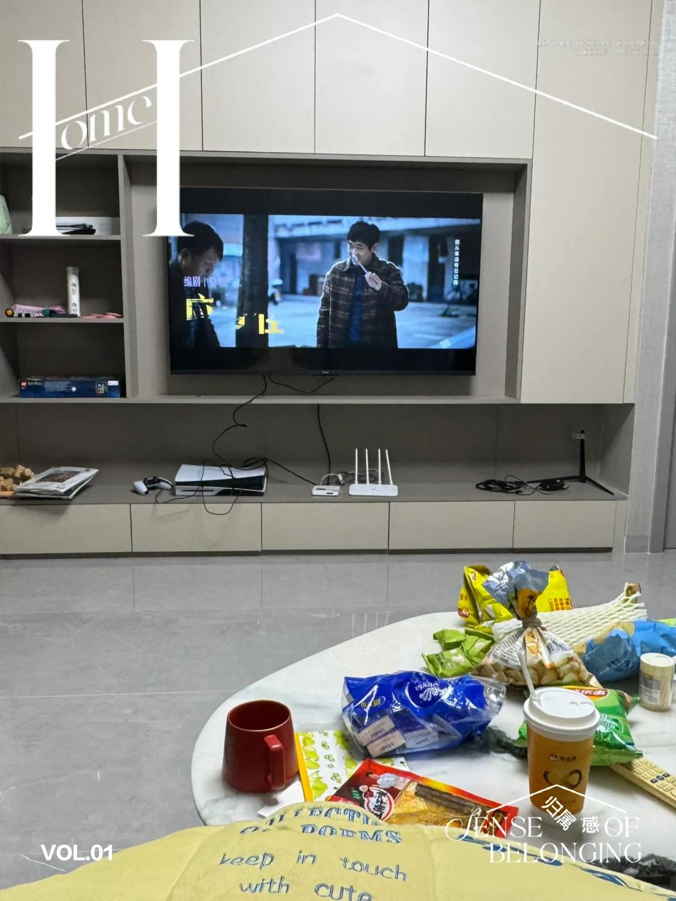
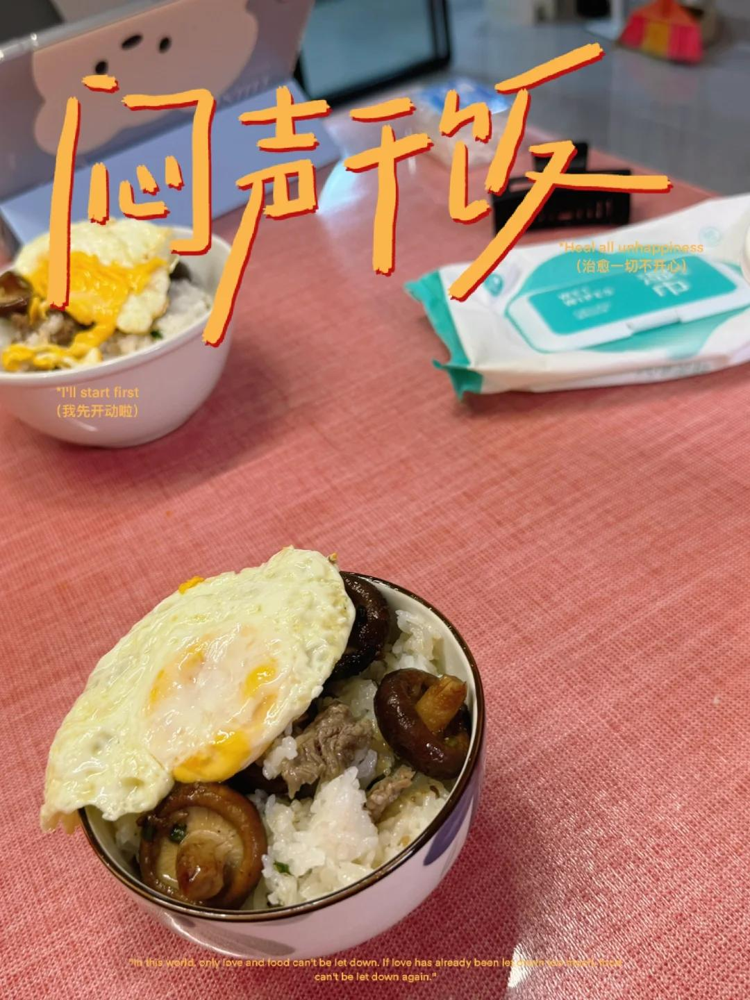
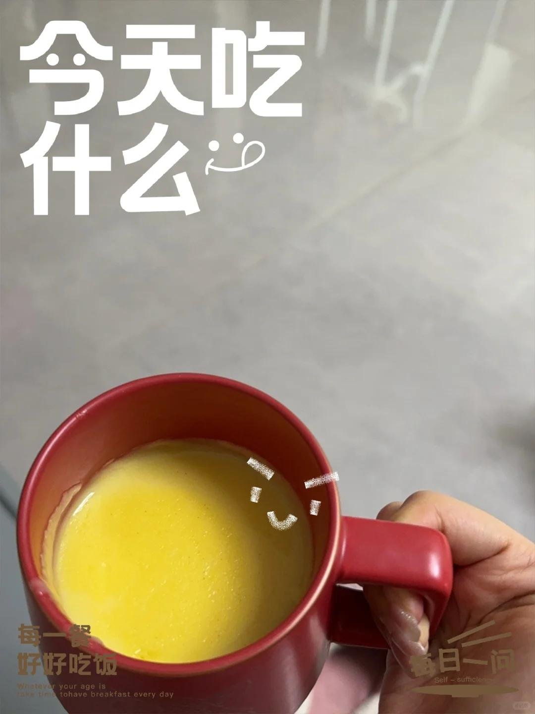

# 周末快乐！！！三人同居在家的快乐生活～

早上被室友们薅起来打扫卫生，巨困
大家分工拖地扫地擦拭桌台，干干净净！
收拾完立马下楼丢垃圾，该洗衣服的洗衣服～
最小的妹妹给大家煮了玉米糊，超好喝
中午大家又煮了酸汤米线吃+点外卖，
有个姐妹发烧了但是要出门，给她煮了姜茶咕咕灌，
洗个热水澡，吃完药才让她出去吃饭饭
剩下我们两个在思考吃什么，小妹妹说做焖饭！
于是我先去洗澡她去做饭🍳吃完我来收拾洗碗～
（宝子跟我道歉说做得不好吃，我说非常好辛苦啦！）
去买葱蒜的时候顺便买两杯奶茶，又下单了小零食，
她打游戏我看电影，惬意又松弛，超级快乐
其实一开始会担心同居大家会有摩擦闹矛盾。
一周过去啦，大家有问题就直说去改善调整，
个人注意自己的卫生，轮流买日用品或者AA，
早上晚上一起下班，回家的路上聊天唱歌🎤
虽然她们最近经常蛐蛐我和我对象哈哈哈，
氮素，还是非常可爱～很有礼貌和分寸感，
慢慢填充这个小家，互相包容互相理解未来会更好！
#周末宅家 #周末快乐碎片 #打工人的快乐周末 #同居日常 #室友 #美食日记 #做饭日记 #记录吧就现在 #快乐瞬间