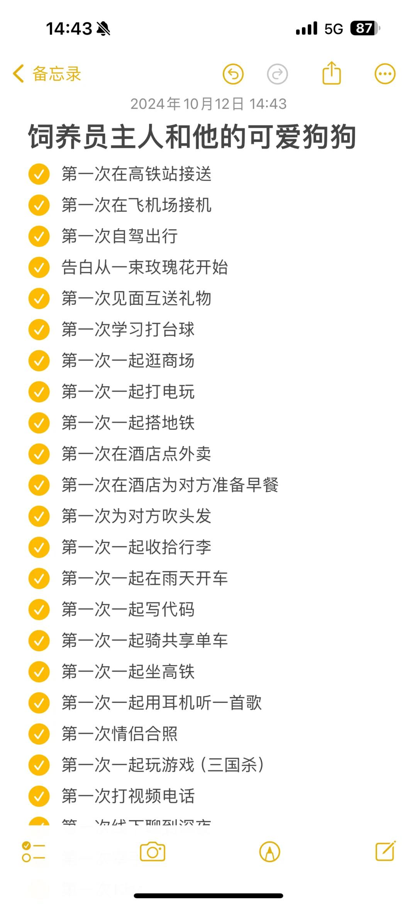
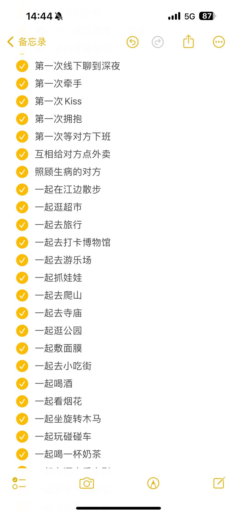
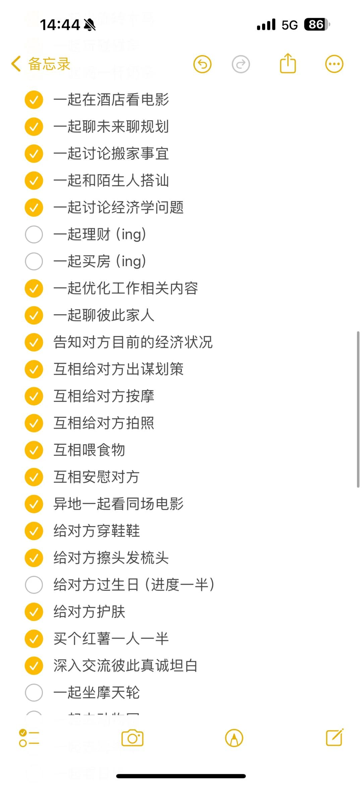
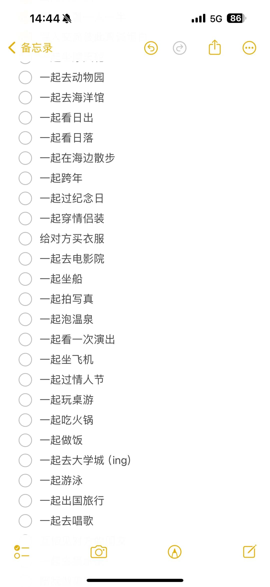
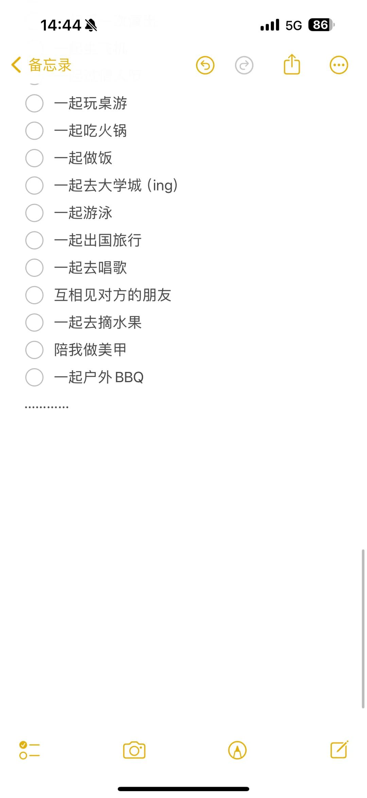
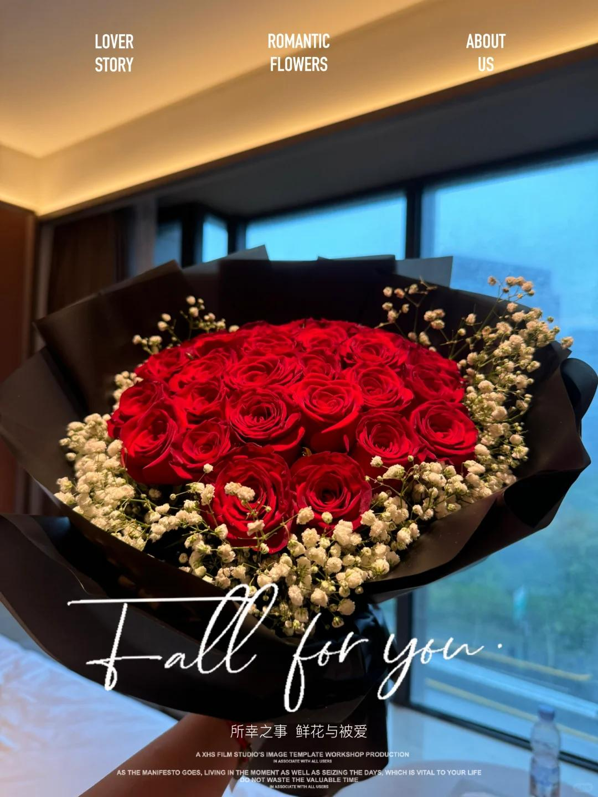
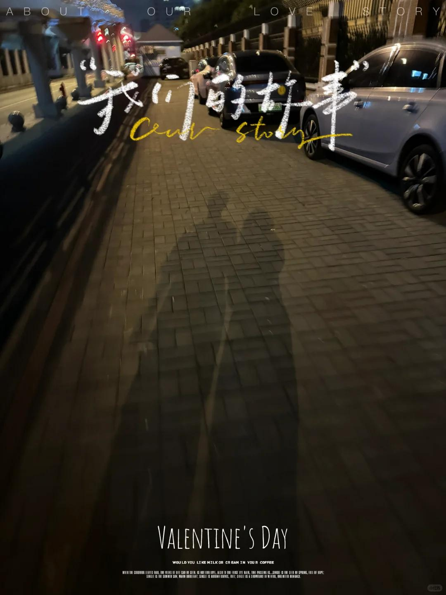

# 大声宣布！终于甜甜的恋爱也轮到我啦～

在今年！2024进入恋爱关系～脱离孤寡团队啦
拥有一个非常好的男朋友，是超级健康的恋爱状态～
有被宠着被照顾着被呵护的，是忍不住想要分享“我有对象”的幸福冲动！
 
《如果要恋爱，请一定选自己很喜欢也很喜欢你的吧》
每天起床都充满动力和能量。你们的磁场会很干净，一切都会很顺利，互相给对方带来好运～
在遇到我男朋友之前，异动城市并且完全更换业务的我，状态很差，但是认识他这半年多以来，整个人变得越来越好，我很满意现在的我
 
———————————————————————
我不是个特别粘人的女生，但是男朋友会经常逗我。
六月每天晚上给我打电话，早上不说早安会小小闹腾。
偶尔会要求我做一些事情，拉近我们之间的距离～
所以，现在的我们非常亲昵，同心一体
 
每天道早安，每天晚间语音完睡觉，每周都会视频；
无论大事小事日常点滴都会互相分享；
未来规划中都有对方，参与到对方的生活决策中；
会很自然的说出自己的想法和感受；
即使很疲惫也想要说几句话，困到睁不开眼也不舍得挂电话，想要和对方再多粘一会，就一会；
会常常给对方准备小惊喜点外卖……
虽然是异地，但是就好像对方在身边一样，很安心
 
☁️我们都相信短暂的分离是为了未来更好的在一起，是信任是期待，可以一起上下班，一起牵手逛街，一起自驾旅行，一起在家里做饭，一起窝在沙发上看电影.....
【⭐️我们都是对方明目张胆的偏爱，坚定和唯一的选择，是真诚的心动】
【🌻他会不厌其烦告诉我未来的计划，是清晰且详细的，是勇敢且认真的】
【🍀会无数次对我说“宝宝，想你啦”“宝宝，超爱你”“宝贝，我会更努力”“有我呢”“老婆超棒”】
【🌙会因为他的无数句想念，愿意牺牲自己时间，凑假期飞去他的城市陪伴他】
 
我们不会约束对方的社交，至少在有限的时间里，除了父母以外，是对方的第一优先级，会努力多挤一点时间和对方待在一起。热恋期，心心念念的肯定都是对象啊～节假日不能常回家陪伴，我们会提醒彼此和父母电话，表达关心和爱。
其实这个【饲养员主人和他的可爱爱爱】6号就在备忘录写好了，记录我们的快乐恋爱日常🎊即使性格会偏低调一些，还是希望能够用文字照片记录一下在一起的点滴，长长久久！
 
#我的恋爱记事本 #记录生活 #异地恋#甜甜的恋爱 #爱情应该有的样子 #好喜欢我的男朋友