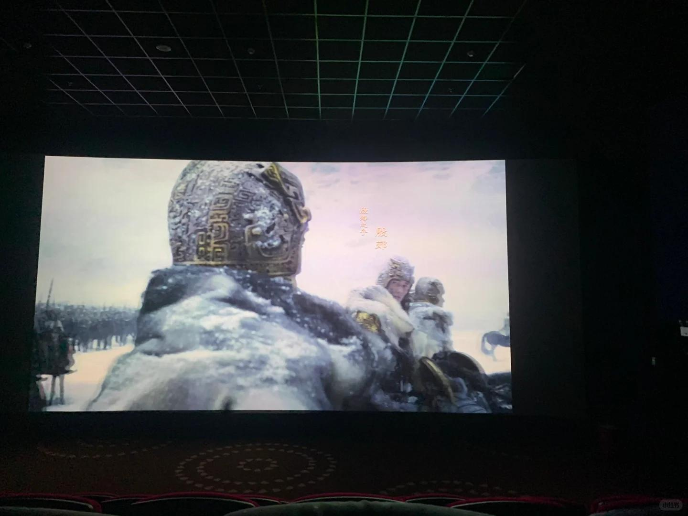

# 封神第一部真的好看！给我冲

#封神 #封神榜第一部 #于适 #陈牧驰
真的很不错呜呜呜，快去看家人们
我想看第二部，一直坐到最后看彩蛋
两首片尾曲都听完了，忍着不上厕所
我泪点好低看得哭唧唧 旁边小姐姐
她时不时回头盯着我看好尴尬
姬发殷郊帅晕我了，质子团我直接嘶溜
现在到处安利人去看，给身边朋友发展到
“你快去看，我给你买票”给我冲
看完后劲好大，我满脑子回味跟人讨论
很多老戏骨，四侯之死那里我泪奔了妈妈呀
伯邑考和姬发，姬发和父亲牢里，感动的！
这个封神从姬发角度去写，更细腻也很独特
特效什么的做得很好，人物性格很饱满
这些小鲜肉真的很棒啊，未来可期