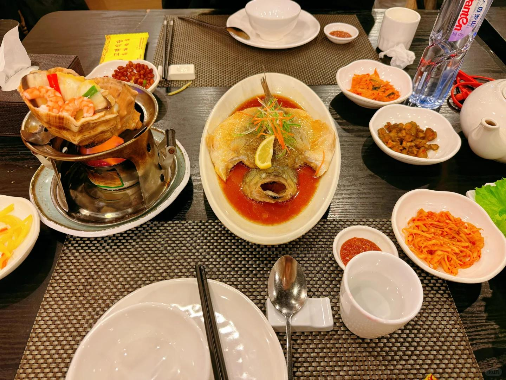
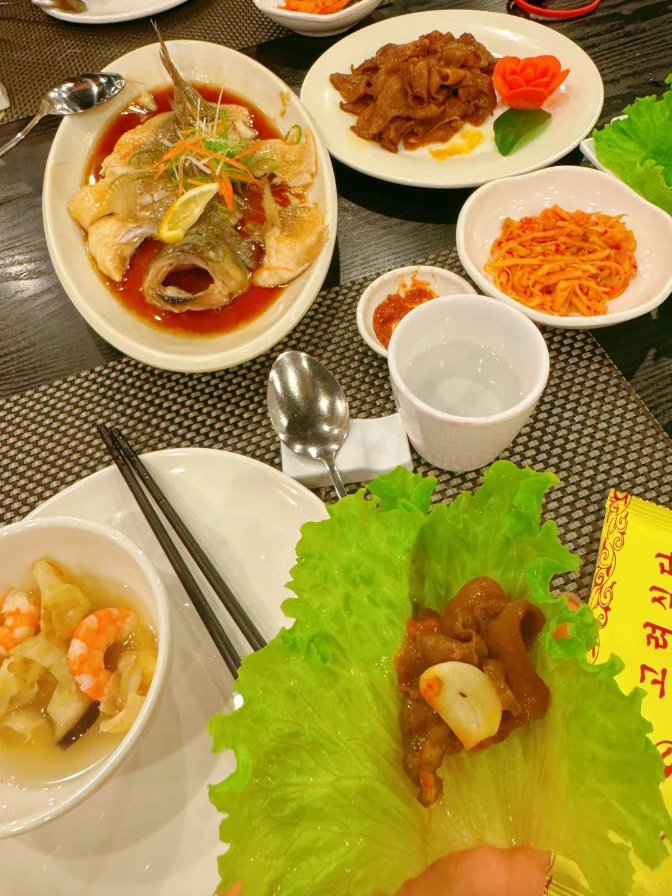
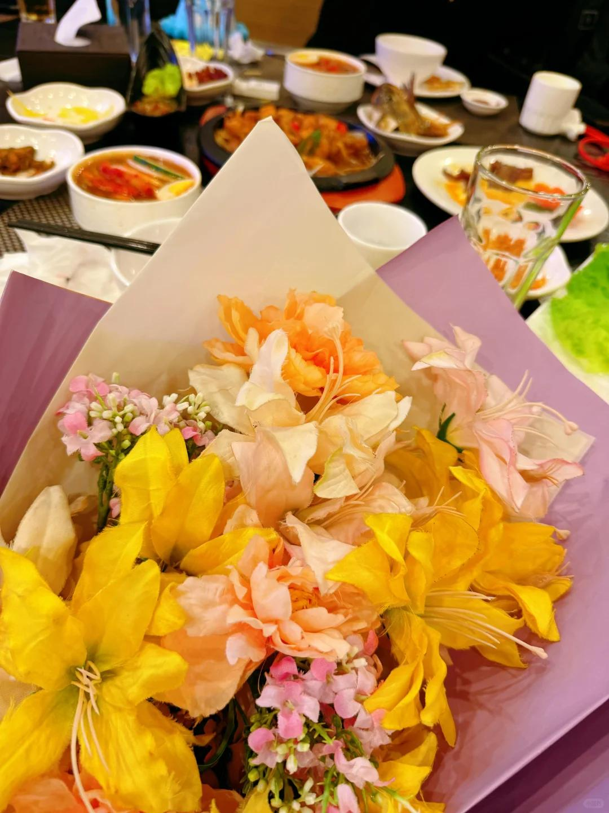
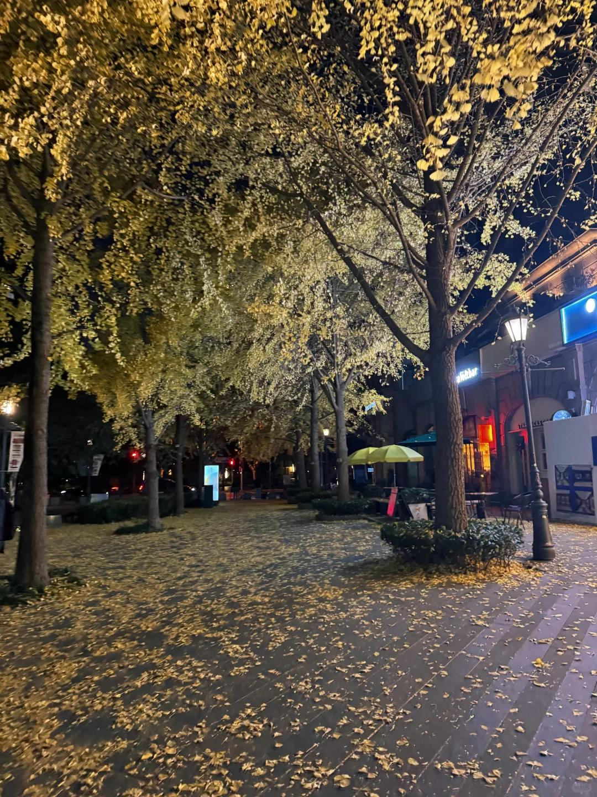

# 异地恋见面之陪男朋友过生日～【一】

2024年的尾巴，飞去上海陪男朋友一起过生日
10.5-12.19，两个没见到我宝啦，异地恋好苦又好甜！
见不到面的时候，会大大方方说“想你”“爱你”，
见面后的每时每刻都想黏在一起，珍惜来之不易的假期！
我觉得我们两个每次旅行都非常幸福的原因，有几点做得非常好！
1.见面那一刻起，远离手机远离工作，非紧急事情不处理，给到彼此最极致的体验和陪伴。
2.即便对方单独想玩什么，也会陪伴着一起参互动【比如陪我对象晚上一起打炉石，我在旁边跟他讨论听他分析，从不看手机】。
3.小问题及时处理沟通相互理解，不要抱怨不要生气【一些计划之外的小意外都可以接受，重要的是两个人一起】。
4.多聊天deeptalk，对象开车的时候我都会跟他互动讲话，不浪费路途的时间，每天晚上睡前早上睡醒，吃饭的时候我们都会沟通和探讨一些事情【情侣最怕的就是相顾无言】。
5.提供充足的情绪价值，一方精心准备好大致行程，另一方无条件信任跟着走，细节可以一起填充【不要一直怀疑，各种问问题，会很扫兴】。
 
—————————————————————
记录一下这次上海假期的行程和感受，比上次中秋见面更加亲密，开心！
 
19号晚上男朋友下班后去机场接我，还给我准备了花花，超爱！起飞前我kuku发消息，起飞后对象kuku留言，落地那一刻才有实感，终于要见面了！
两个人完全没有陌生感，在机场抱了好一会才打车，期间走错路+车还被司机取消一次，风里等了好长一会，但是我们都没有表露任何不开心，男朋友给我暖手手～
 
本来想要直接回家，对象怕我饿还是吃了夜宵，坐在同一层架在男朋友腿上，嘿嘿，摸摸索索，太太太开心了！为了攒假，连续上了十二天班，这一刻见到他都值得啦！
晚上和男朋友一起穿上我买的情侣睡衣，嗷呜，骄傲，叉腰，我的男人！
 
20号对象上班，早上他去公司以后我就起床洗澡化妆，中午他接我一起吃饭饭，下午狠狠补了觉【我一直是睡眠不好的人，周末在家都睡不了回笼觉，在男朋友家里真的呼呼大睡！这几天晚上虽然睡得少但是睡得很熟很香！】
睡醒以后接他下班，这还是我第一次接男生下班诶，真的很神奇。看到对象从门口出来的时候，开心的蹦蹦跳跳走过去，一起去吃晚饭啦！
#今日限定浪漫 #每天都有值得记录的瞬间 #异地恋见面 #恋爱 #标记我们的浪漫生活