# 异地恋见面之陪男朋友过生日～【三】

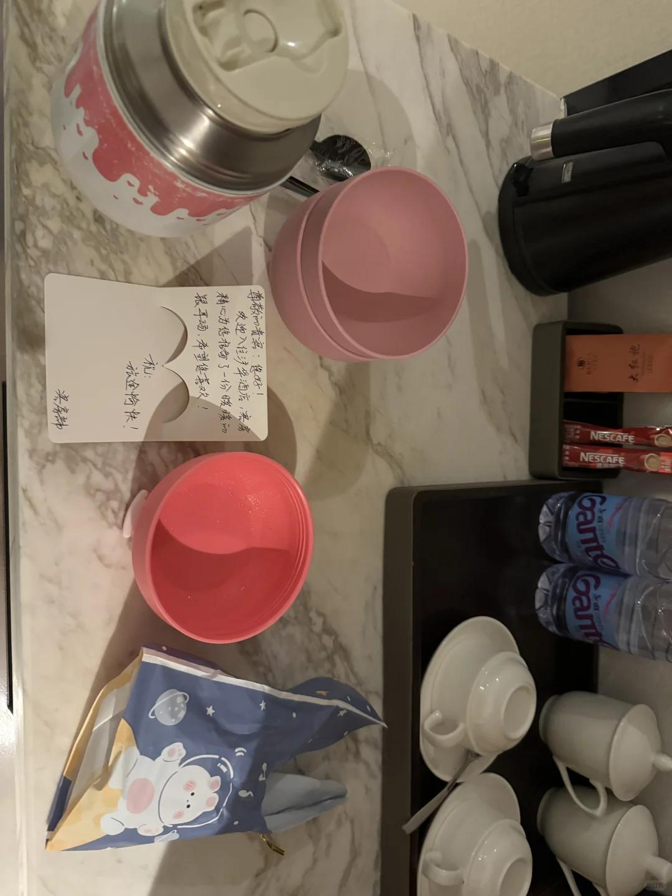

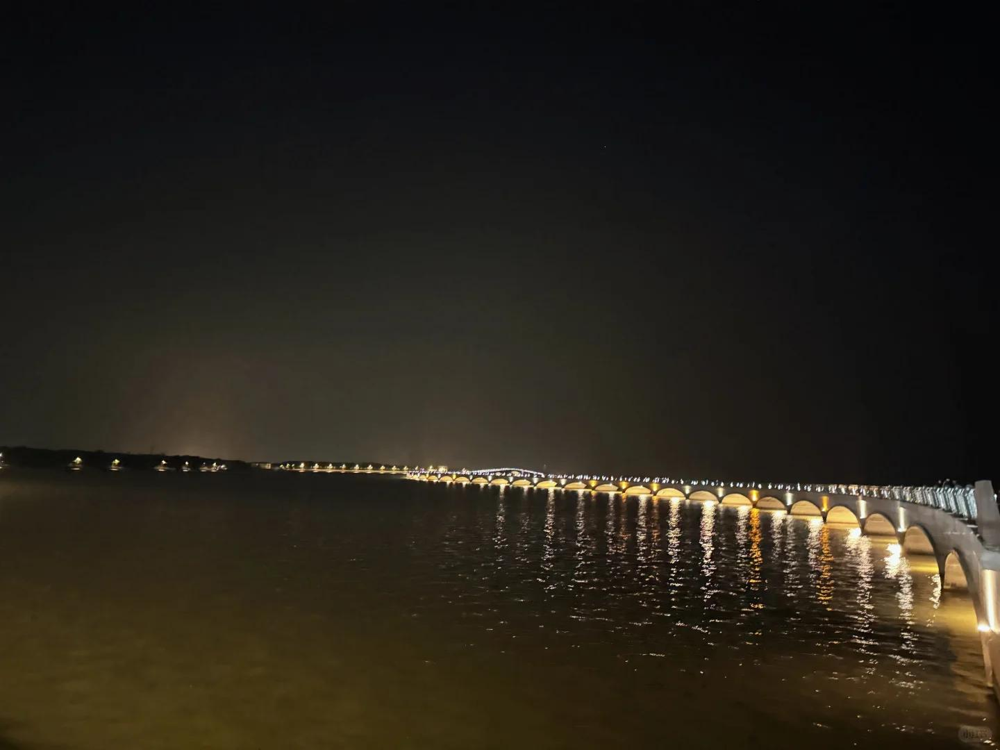
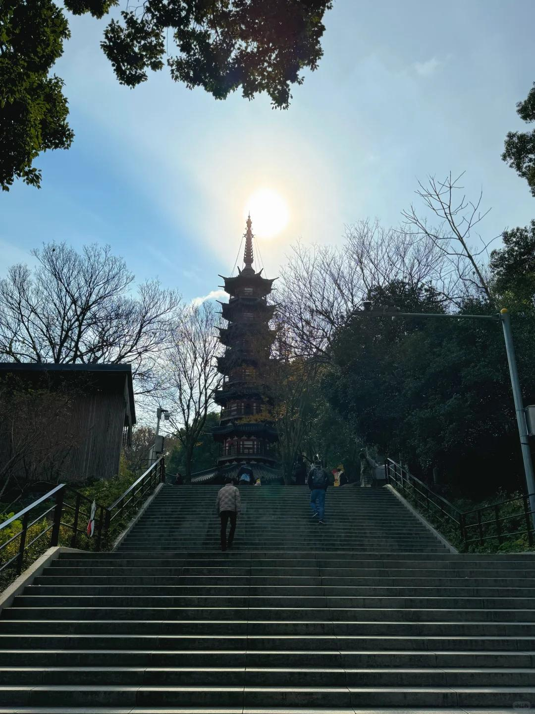
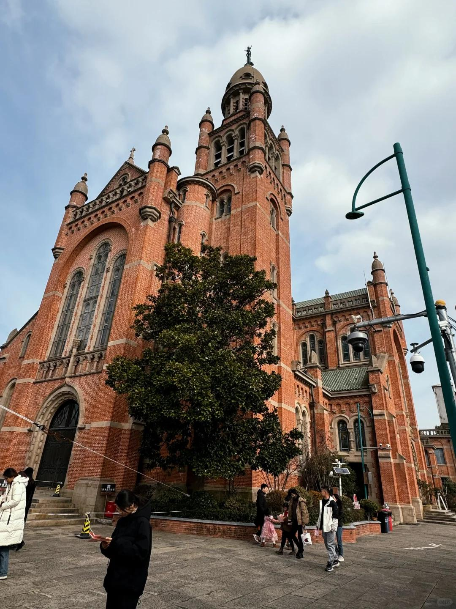
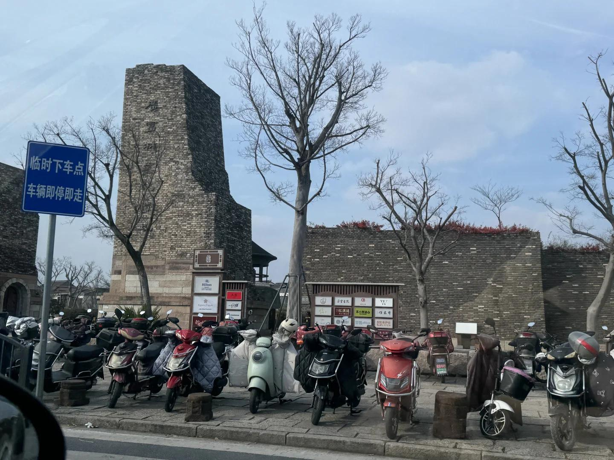
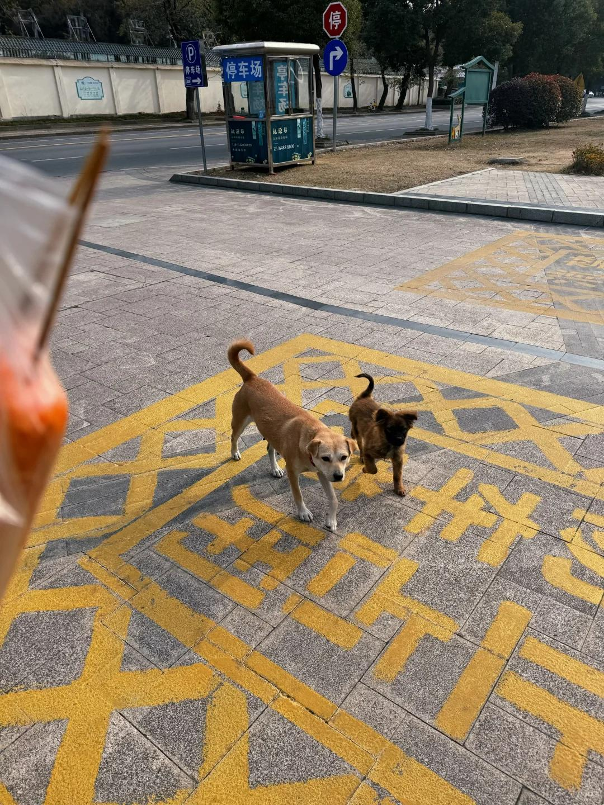
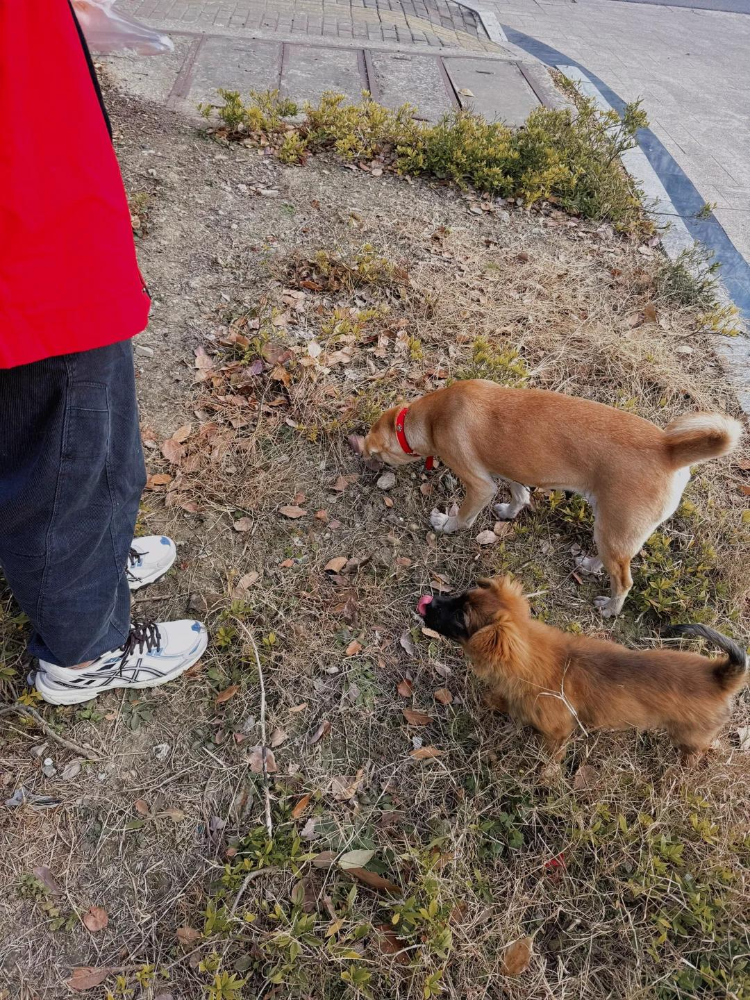
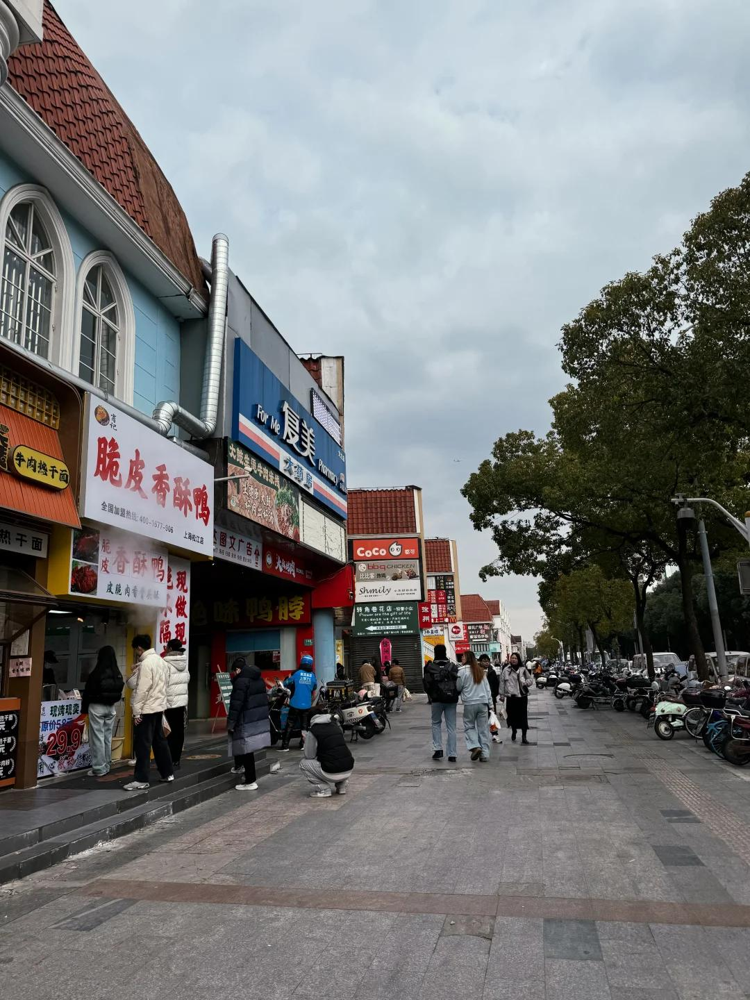
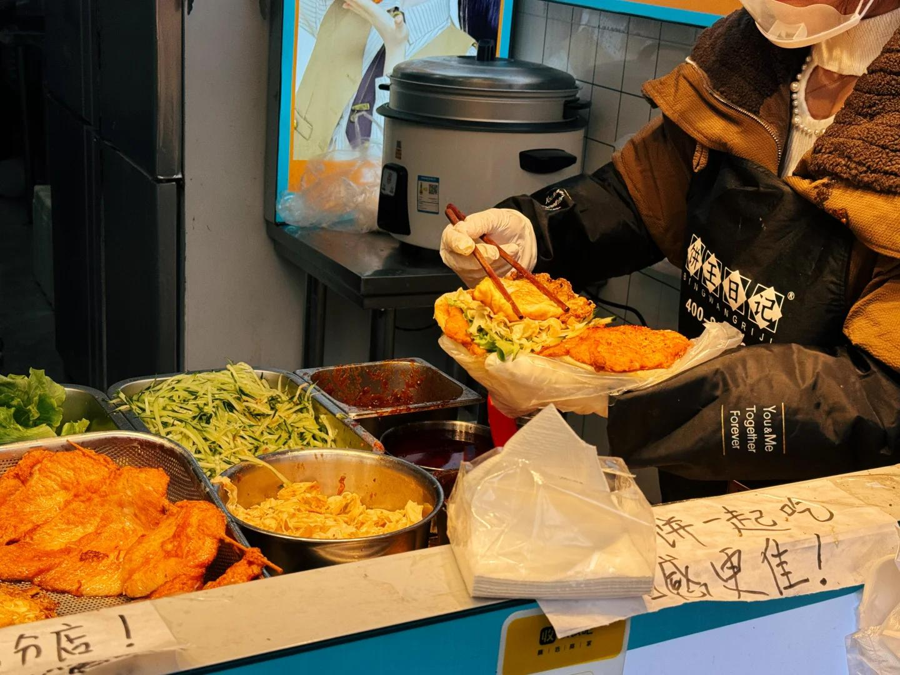
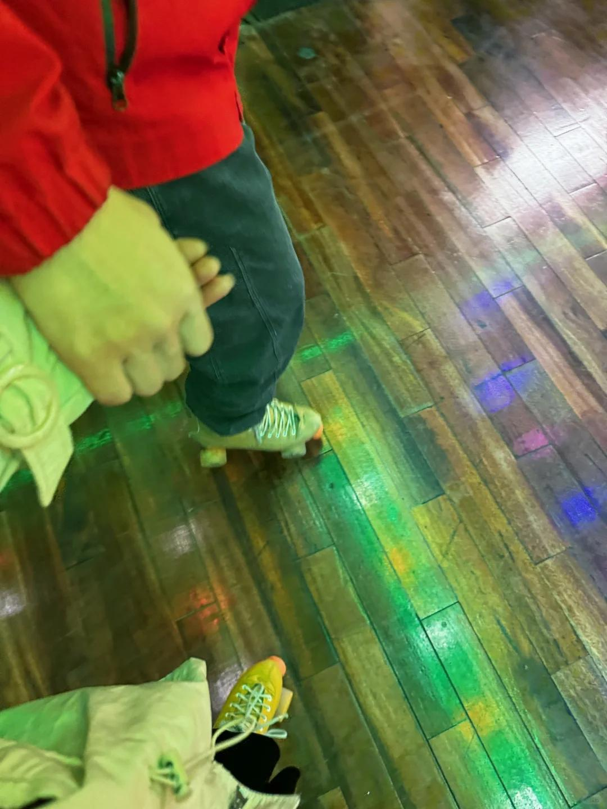
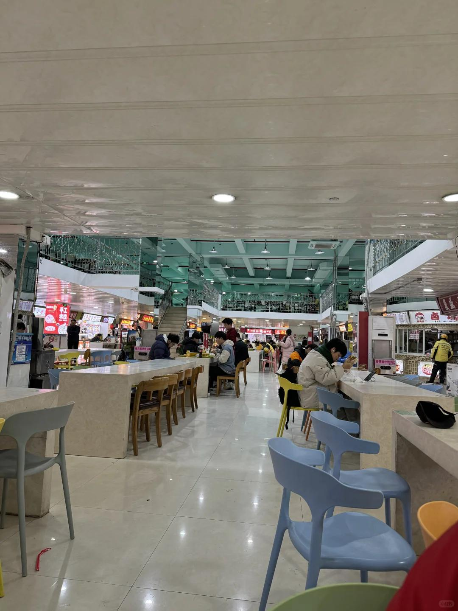

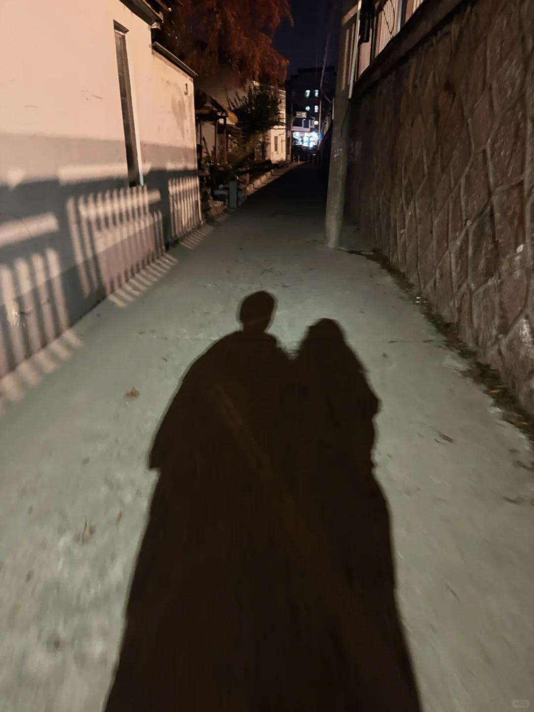

接【二】
出景区的时候绕远了，男朋友带我走了个偏僻小路，黑乎乎的有点害怕问了2次他真的是这么走的吗？以后我要更加多多信任他，不要再确认了！晚上呼啦啦又开去淀山湖附近的彩虹桥【这个狗子还说要在日落的时候在那里对我许下一生一世的诺言，害我期待了一番，结果两个人吃饭没赶上日落】
 
22号最后一天了，早上开车去佘山公园转一圈，说好只是转转，被这个男人拉着爬了一小段山，今天腿还是抖的！终于吃上了我的10元肉肠和7元两根淀粉肠，我们俩还针对山脚下两个卖肠的摊子进行了一番研究～快到停车场的时候，两只小狗嗅着烤肠味道看着我们，本来是不打算喂的，那只大黄一直跟着我们，很坚持！男朋友“被感动”咬两块喂了狗狗～
 
接下来的行程是松江大学城！体验平价学生时代的美食，小馄饨、肉里脊，双皮奶奶茶，一路上好多对小情侣，我们两个混在其中一点都不突兀嘿嘿，明年或者后年和对象去他学校玩，毕竟我尊贵的武大985男朋友哈哈哈！一路上又聊了很多学生时代的内容
 
下午男朋友带我去溜旱冰，家人们谁懂啊，我不会！男朋友一直教我带我滑，鼓励我夸我，电视剧里男主带女主溜冰的场景居然发生在我身上了。哦莫，虽然摔了四次，手掌和尾巴骨今天还在痛，他弥补了我大学校园的遗憾。
 
中途男朋友找车位绕进了好几个小巷子，我让他不要往里开他还是开进去了，有点小生气不高兴，但是想来他也有自己的判断，大不了就是卡着耽误时间或者刮了一点车车，出来玩避免不了意外，后续自己也要调整，多平静从容一些，都是小事呀！
回家还车的时候出现了一个小插曲，车前面的漆蹭了2道，本来说单面600，我都震惊了，后来工作人员跟我对象交涉了一番，最后没有赔偿【我猜可能是有保险，看了下xhs说1500以内不用赔偿？具体还没研究】
 
晚上吃完潮汕牛肉火锅在家里聊了很久，聊明年的规划，工作、感情、事业，推进我们的杭州买房买车计划，推进我们结束异地的进程，还有推进明年见父母的时间～～之前我的朋友一直在问这个事情，但是我不想提，但是我对象很靠谱也很有担当，都有认真考虑这些事情，希望能在更多方面给我安全感，即使他一直说只有我最爱我，想和我走下去，已经认定我这些话，但是行动和语言带来的冲击力还是不一样的。
真的很感动，希望我们两个人能互为依靠互为支撑，2025能一起做更多事情，攻取天下！
#异地恋见面  #恋爱