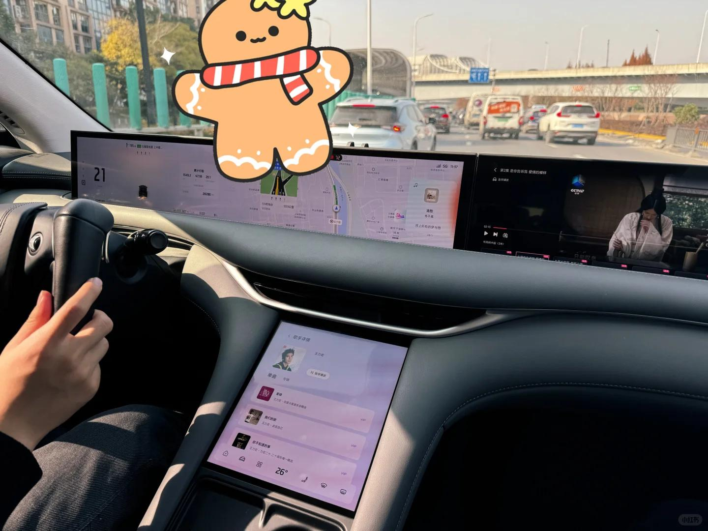

# 异地恋见面之陪男朋友过生日～【二】

接【一】
 
晚上对象选了一家奢侈的晚饭-高丽饭店，笑死，朝鲜族，菜品一般但是价格真高，表演都是小姐姐，诚诚老师破费了哈～服务员有问有没有过生日的，想着对象昨天生日把他报上去，最后果然是上台集体庆生，我在下面疯狂拍照拍视频，哈哈哈可可爱爱！
 
吃完饭一起散步回家，从银杏树下走过，两个人拉手手抱抱，拌嘴打闹，风很大心很暖，因为身边是他，微小的幸福也变得格外美好。那一刻幸福都具象化啦，真的想就这样和身边这个人一起走很久很远
 
快到家门口买了零食和酒酒，今天的主线任务是，一起看电影+玩游戏，男朋友选了一部《阳光姐妹淘》，感觉很一般～～看完电影打炉石和4399小游戏！之前聊天说了好几次想玩Q版泡泡糖，终于和男朋友玩上了，又体验了很多我们小时候的flash游戏！快乐很简单～
【这个狗子夜里想吃DQ，大半夜送来快1点啦笑晕，开着空调吃冰淇淋】
 
21号早上起床去取车！男朋友一直耐心等我化完妆这次选了智己的电车一起体验，未来我们也是打算买电车，实话说这次体验感还不错！男朋友开车车带我出去玩真的好快乐，车上也是属于我们两个人的私密时间，开到森林公园的一个多小时，我们都在聊天听歌吃东西，我是合格的副驾哈哈哈，快到终点的时候为了让我练车让我开了一会，电车的倒车影像很nice，我都不禁夸自己倒车正正好哈哈哈，男朋友疯狂在旁边夸夸夸，“开得非常好”“你开车门的时候太酷了就是女王”尾巴都翘起来了～
 
虽然这个郊野公园很破很荒，景色实话说一般般，但是和男朋友一起玩就是最快乐的！平时我们都在城市里太久了，很辛苦开了一个多小时车车带我来这里体验大自然，全程注意力都在我身上！感动得哭哭风巨大，抓着我的爪爪怕我冷，还给我挡风！
 
逛完以后跑到朱家角停车场充了一小会电，蹭了个30mins免费停车哈哈哈，我们两个大聪明一天没吃了饿饿在附近吃饭饭耽误了后续的计划，上海的天黑的太快了～【不是我说，这开车到哪停车，嘎嘎就是10块15块，心疼呜呜呜，这停车费可真好赚呀】
晚上想着既然来了就一起在古镇逛了一圈，男朋友想给我买东西，但是古镇大多都是坑坑，最后选了一个小铃铛哈哈哈～黑红交替的锦鲤，希望我们2025都更加顺利！
#是爱与被爱的新一岁 #异地恋 #恋爱 #异地恋见面 #记录我的生活