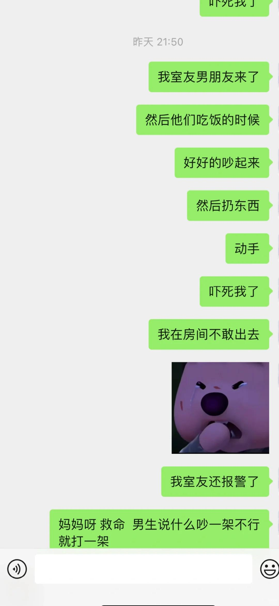

# 情绪稳定的男友真的很重要！！！家人们！

半夜起来抓蚊子睡不着了，
顺便记录一下今天发生的事情。
我室友，是一个非常非常nice的小姐姐，
但是她的男朋友，性格比较内而且有点自大。
今天我回来的比较早看见小姐姐在沙发上，
她男朋友来了在做饭，因为明天是周末。
我就回房间吃蛋糕🍰顺便处理工作的事情。
没过多久，两个人就吵起来了男生很大声，
甚至摔东西，隐约还动手了，大概是推人！
没敢出去，听到小姐姐报警了，两个人又吵了一会。
室友说：请你10点之前离开我家，检查一下心理医生
男生说：我本来马上要走，你心理才有问题
中间我很清楚记得男生说了一句：
“吵一架不行就打一架”？他怎么说的出口！
安静下来又跟没事人一样吹口哨吃饭，好淡定！
具体吵架的内容我记不清了，本身也没出房间。
没过一会警察来了，男生就开始吐槽小姐姐
说什么男女朋友，小姐姐说他，睡觉吃饭说他，
自己忍了一天了吧啦吧啦之类的，最讨厌什么什么
小姐姐说 你怎么不讲一下打人的过程等等，
然后就是警察在调解，我也记不清惹
后面我去卫生间出来了一下，男生在收拾东西…
没敢和室友说，也没问，真的太尴尬了😅
小姐姐尊嘟很好，我觉得他男朋友配不上他！
有一次我们两个逛山姆回来，下着雨开电驴的，
男生在我们到家以后来的，说小姐姐不接电话不接他，
自己冒着雨从地铁站回来，啊这……
小姐姐关心他拎了吃的，很凶，“我吃什么不要你管”
救命，我脚趾抠地立马回房间，实在是看不下去。
虽然我室友也是有点啰嗦的那种，但是为他好诶～
 
反正，三十几岁的男生，想发疯就发疯，控制不住情绪，
对女朋友动手，我真的瞧不起，尽管学历好工资高，
又怎么样呢？我不理解，为什么小姐姐一直没分手…
可能就是习惯？断不了，真的不适合，经常吵架。
生活习惯，饮食口味，性格都合不来哇
#情绪稳定 #情绪稳定的伴侣 #情绪价值 #恋爱