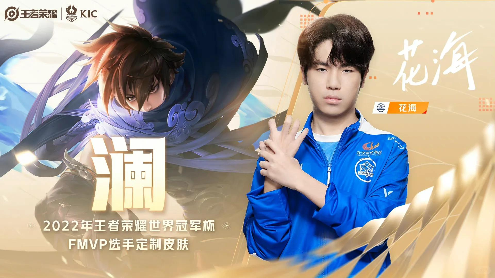

# 我那进步很大的主队！拜托继续加油！

说真的，第一把Bo7打到巅峰对决确实进步，
虽然中间有bp失误、反向闪现、掉点等等，
但是对于一个春季赛夏季赛挑杯一路看过来的，
本ies觉得孩子们有努力正视自己的问题了！
昨天两个0:1落后打平，状态真不好，
今天很火热，晚上打的第一把太可惜了
破三高被翻盘我心脏都不好了，急救……
总之，恭喜🎉770拿下第一胜，今天都辛苦了！
明天继续加油，咱们努力进正赛好不好🥺
易坦子融花，一坛紫融花～相信你们会好起来～
从21年22年，如今呢23，高峰低谷都走来了，
只要你们在变好，在进步在努力我们就有希望！
五个人再好好打比赛吧，拿冠军吧我的eStarPro，
一个人的职业生涯真的太短太短了，好好珍惜
罗思源真的很棒，他很努力很认真很热血很纯粹爱电竞！
最爱的电竞选手、没有之一，因为花海看比赛玩游戏身边的朋友陪我一起看es比赛，跟我一起讨论！会因为你们赢而开心，因为我他们认识了你们五个复活吧我的爱人意思大！
 
#花海 #罗思源 #武汉eStarPro #武汉eStarPro花海 #王者荣耀 #kpl #kpl世界冠军杯