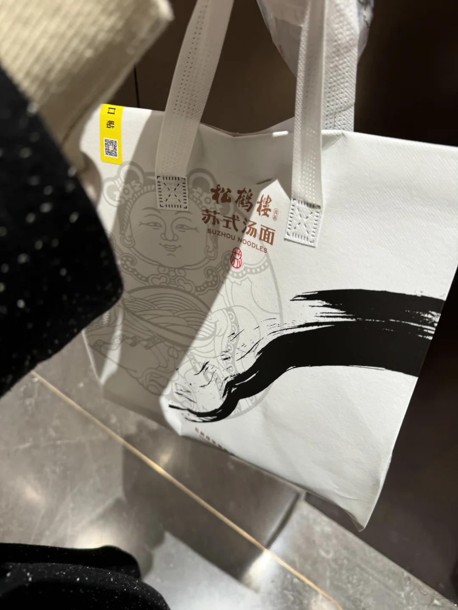
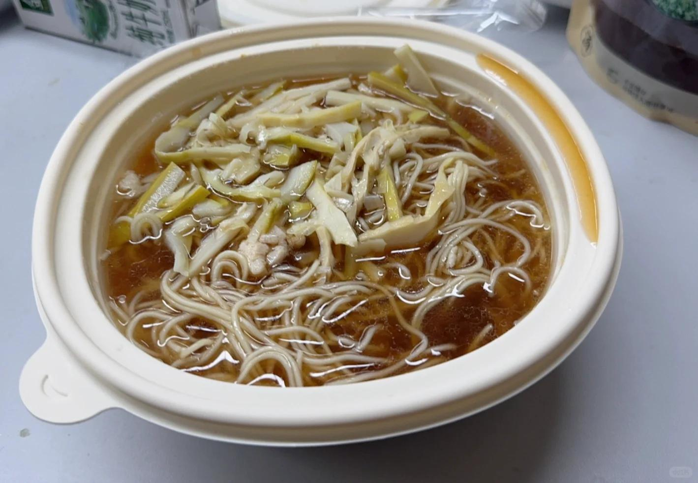
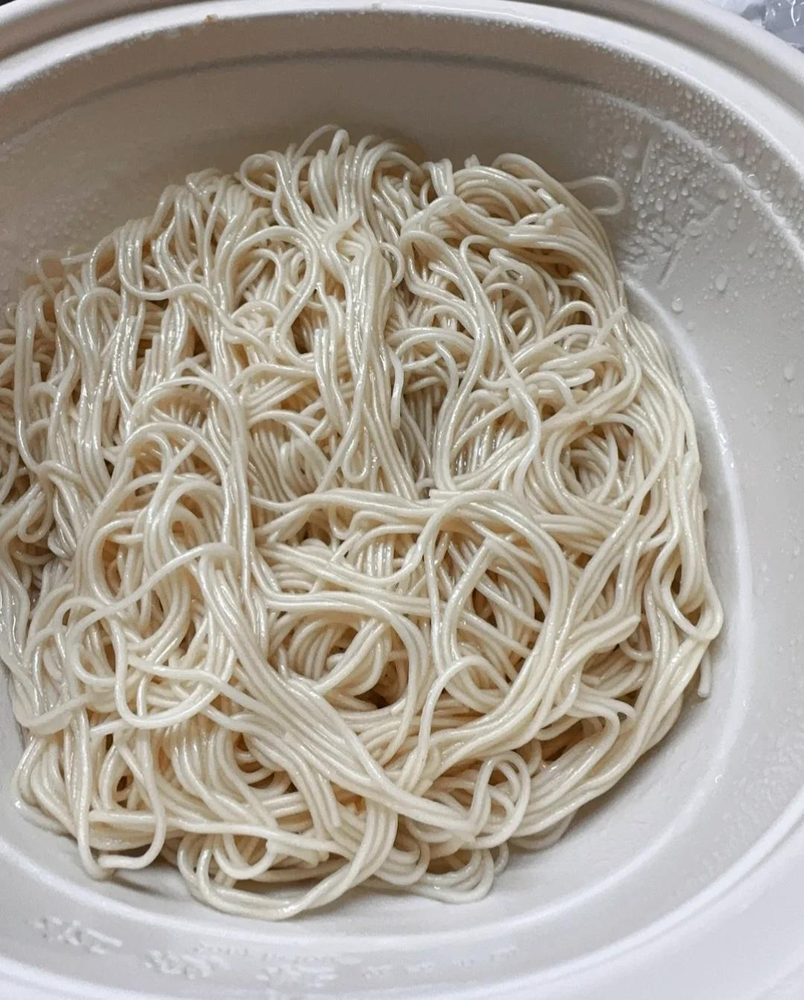
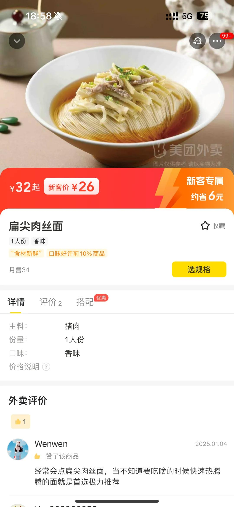

# 松鹤楼 我葱呢？？？我面的葱呢😭

今天深圳降温了再加上没睡好，有点蔫～
下午对象说让我吃点热呼呼呼好的（今天我俩都在加班）
看了我公司附近没有海底捞，有牛肉火锅让我去，
实在是不想动，整个人懒洋洋了拒绝了两次…
对象因为我不想去吃火锅，也取消了自己的海底捞计划，可怜的宝宝说要跟我同甘共苦
到饭点，跟我同桌聊天他说吃面
 
诶，人吧，他就突然馋了！！！我就给我对象说想吃面，
一开始他还在执着给我点火锅外卖，谭鸭血
我说，我想吃面……
他说，那我给你点渔粉吧，五谷渔粉
我说，啊啊啊，要吃面，不是粉！不是米线
他说，啊，我们那里都不分都是一样的
我说，我们那里分很细，粗面细面，哪种分都拆拆，我要汤面，不要辣，要葱要葱
他说，我是ChatGPT是吧，现场输入指令
我嘿嘿嘿傻笑，面面！
同桌本来说出去吃番茄鸡蛋面后来没去，问我咋个点面没喊他，现在看来，幸好没喊。他，我幸好没吃
 
苏式汤面松鹤楼，感觉挺有名，可能因为我是江苏人诚诚老师就给我点了这个，感受一下家乡的味道
但是，不是，这啥呀，面面邦邦硬，一坨坨！说好的肉丝面，不超过五根肉丝还有你图片不是有葱，我葱呢？？？大哥，我的灵魂葱呢味道，一言难尽，寡淡，不鲜，不是我说真的不如本地江苏一些路边小面馆，本江苏人真的吃不下去，那个笋也是不咋地……
 
翻了一下手机找到之前在江苏吃的面，没找到这种红汤面，但是真的不一样！（前提，外卖那两张也加滤镜了）总之，避雷避雷避雷，江苏的面，好吃的千千万！扬州阳春面的图我实在找不到了，淮安长鱼面、东台鱼汤面，镇江锅盖面，南京皮肚面，南通虾籽面
 
呜呜呜过年回家吃面🍜（嘿嘿下周同桌说带我去一家好吃的河南烩面）
#一人食吃什么 #松鹤楼 #江苏 #面 #苏式面 #汤面