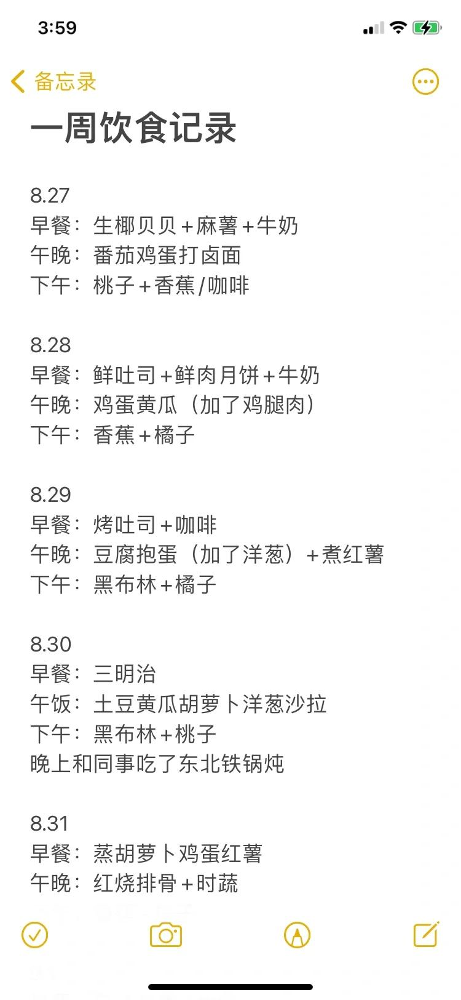

# 浅浅记录打工人的一周三餐饮食

8.27
早餐：生椰贝贝+麻薯+牛奶
午晚：番茄鸡蛋打卤面
下午：桃子+香蕉/咖啡
8.28
早餐：鲜吐司+鲜肉月饼+牛奶
午晚：鸡蛋黄瓜（加了鸡腿肉）
下午：香蕉+橘子
8.29
早餐：烤吐司+咖啡
午晚：豆腐抱蛋（加了洋葱）+煮红薯
下午：黑布林+橘子
8.30
早餐：三明治
午饭：土豆黄瓜胡萝卜洋葱沙拉
下午：黑布林+桃子
晚上和同事吃了东北铁锅炖
8.31
早餐：蒸胡萝卜鸡蛋红薯
午晚：红烧排骨+时蔬（无主食）
下午：香蕉+橘子
9.1
早餐：包子烧麦+牛奶
午饭：烤鸡腿+烤时蔬
周五晚上休假咯和朋友出去搓饭
9.2:
中午烤鱼
晚上家常菜
下午一杯霸王茶姬还吃了点小零食水果
【救命！！！忽然胖了胖了3斤我哭了】
感觉也没怎么乱吃，噗噗也很正常……
昨天晚上熬大夜里今天早睡明天早上再看看
9.3
早上：鸡蛋+辣汤
中午：红烧排骨/西红柿鸡蛋/茭白肉丝无主食
下午：晴王+枣子
#我的日常饮食
#日常饮食
#清淡饮食
#打工人带饭
#健康饮食