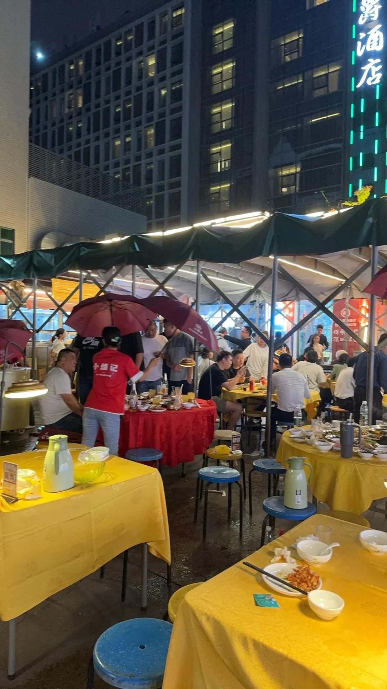
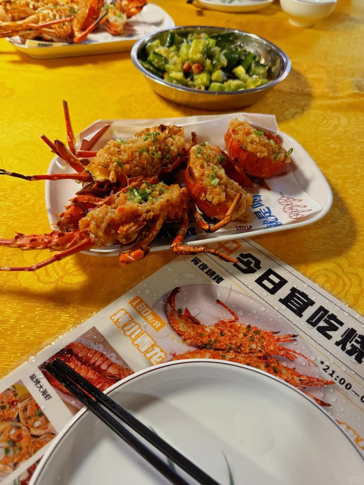
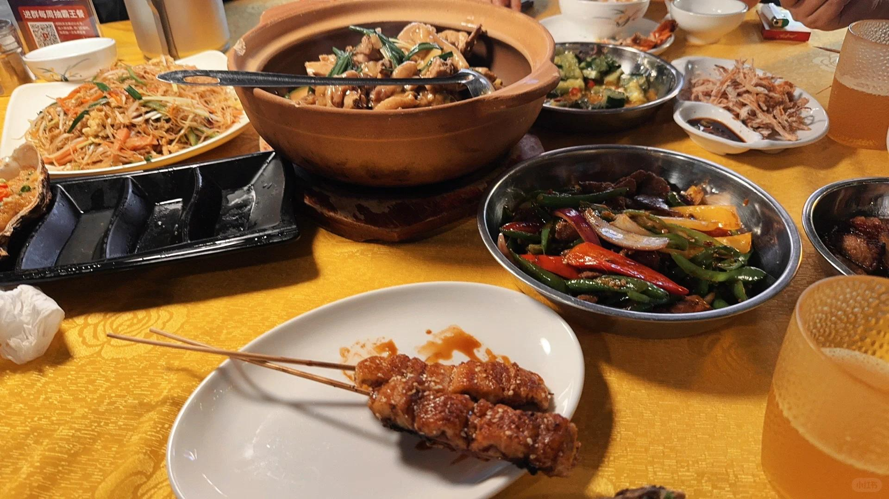
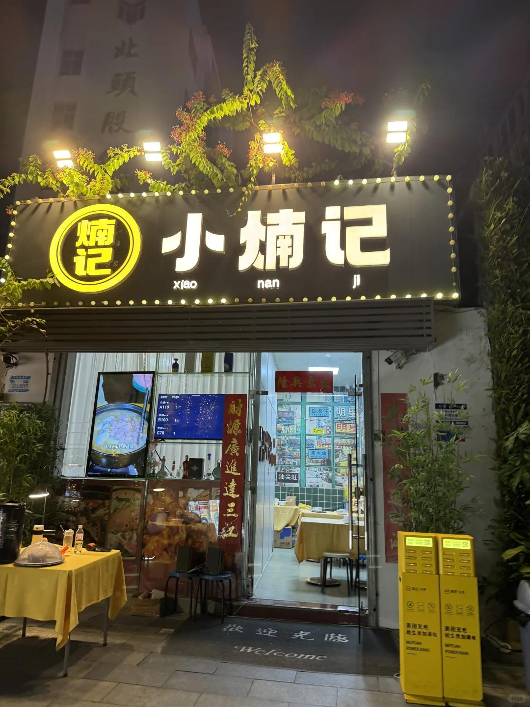
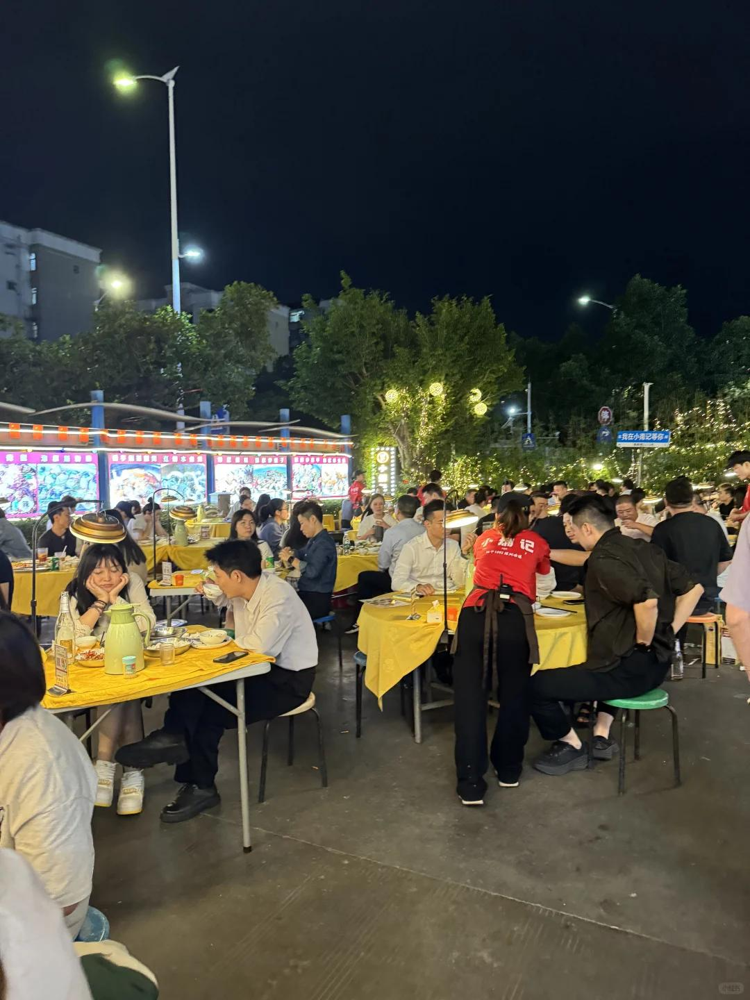

# 深圳小煵记，休想再坑到我！

看网上推荐大排档这个店昨天下班去了，
首先不得不说，小煵记人是真的多呀
刚洗完碗筷就下雨了我？？？
好在后面雨停了，但是篷子也搭起来了
美团写的人均100真的是大骗子呀！根本不是，
我们人均吃了四百400一个人我吃什么不好吃这个，
打扰了🙇再也不会来了，都是坑……（我不会被骂吧）
价格一方面，环境也就那样，被蚊子咬死了
口味也是一言难尽！！怎么吐槽都不够！哎呀呀
小青龙180一只，我们点了两只，烤得很老，没吃完
肉质一点也不鲜嫩，吃在嘴里很柴，蒜香味也没融入～
蟹粥188一份，分量很少，粥米很稀很稀，跟水一样，
比不上如轩的海鲜砂锅粥，海鲜也少得可怜
其他的，什么炒牛肉猪颈肉，都那样吧！
 
半打生蚝就吃了四个，不是很肥美鲜嫩
那个鸡煲大概也不到200吧，没味道！
不是，炖鸡而已，怎么能做得那么难吃
我们每人就尝了一块再也没碰过………
对了，其他什么烤鳗鱼干撕芥末鱿鱼炒米粉，
哎呀呀呀，还不如路边的烧烤店做的呢
最后只有一个菜吃完了，拍黄瓜嘿嘿嘿
每道菜都是差不多百元左右价位，口味配不上价格。
真的好想问，到底谁在推荐啊，避雷吧求求了🥺
#深圳大排档 #深圳小煵记 #宝安美食 #深圳夜宵 #深圳美食