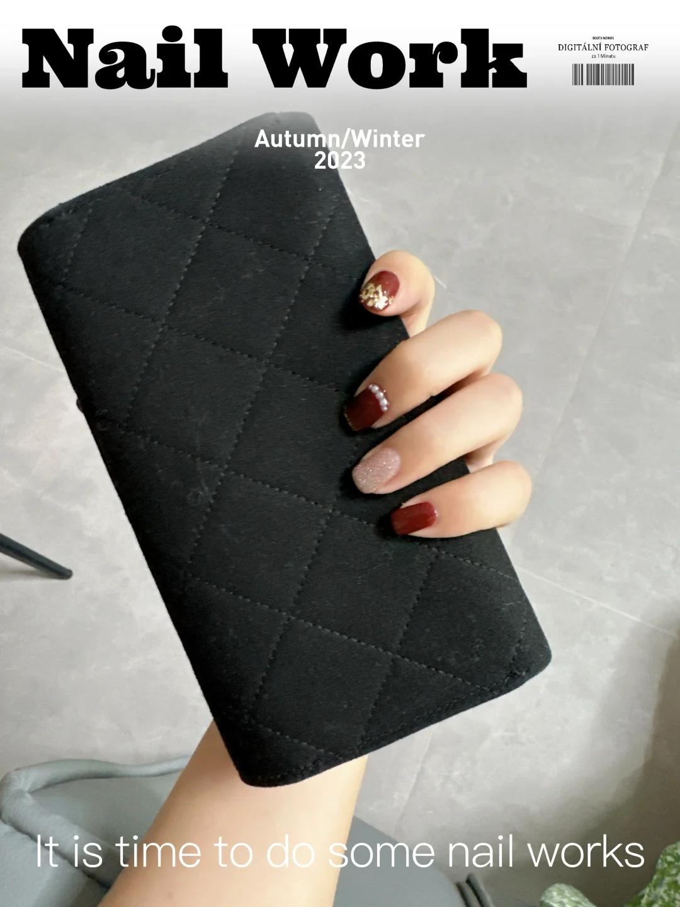
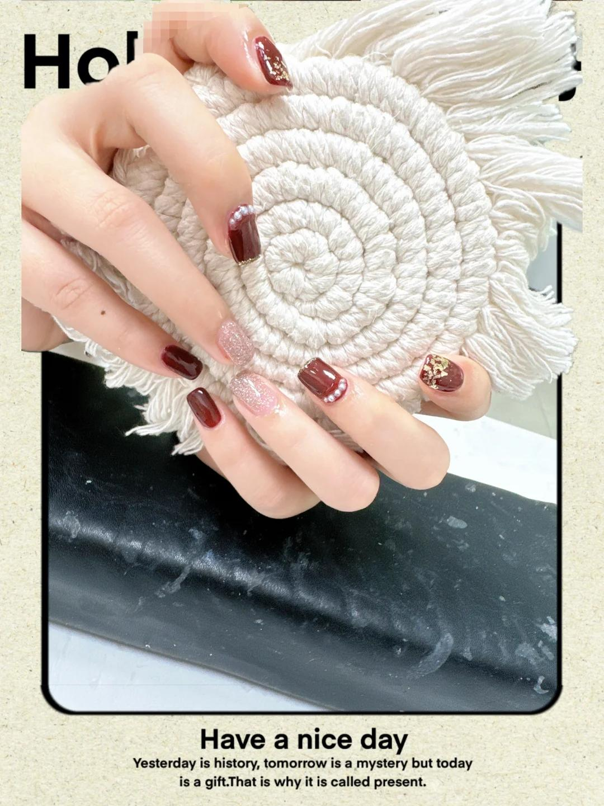
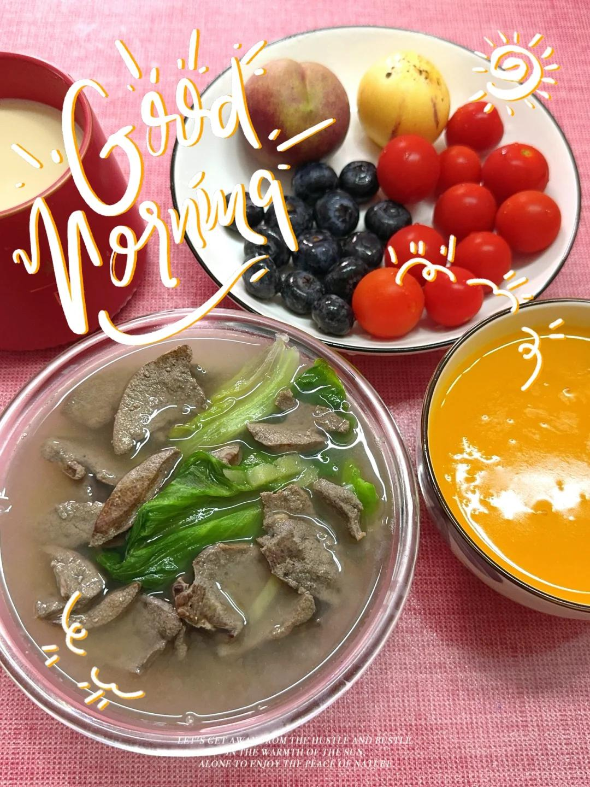
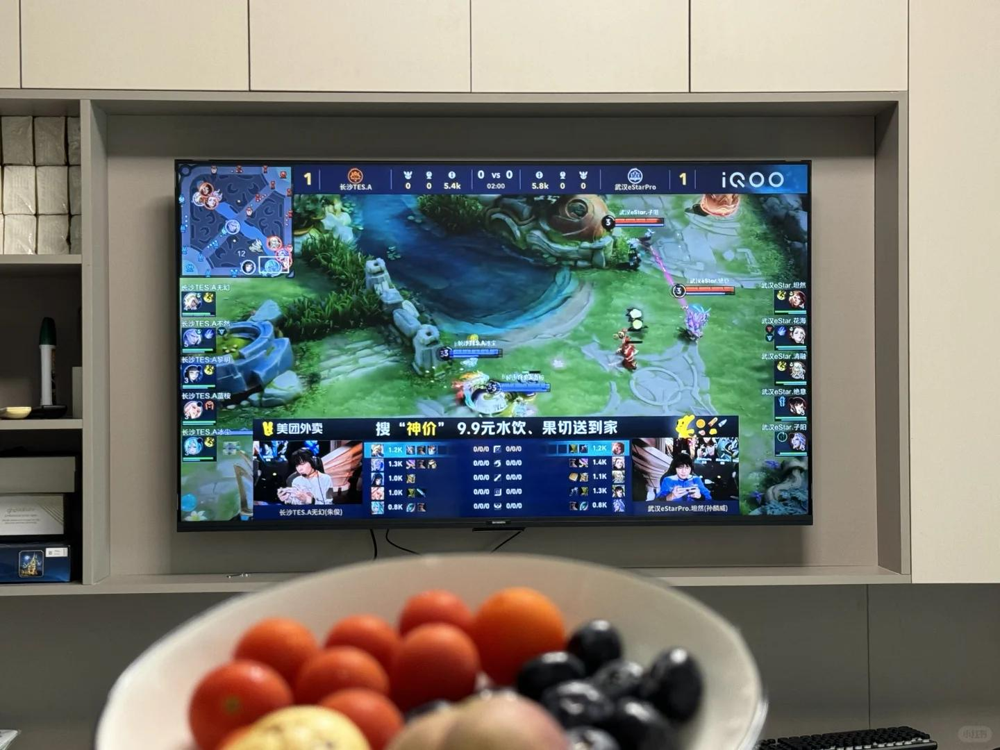
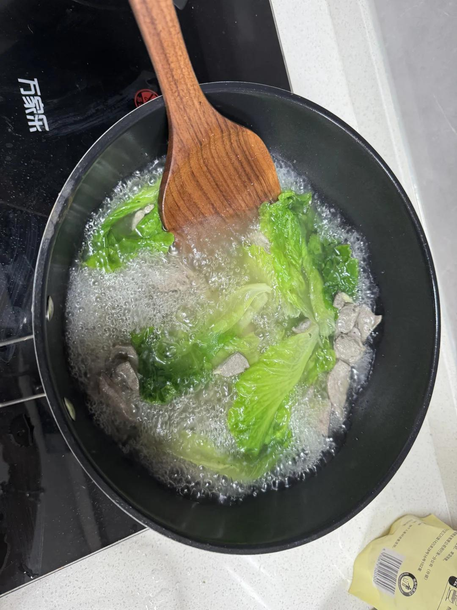
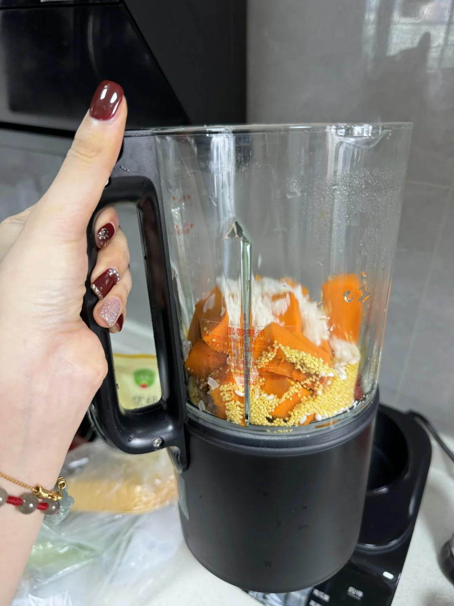
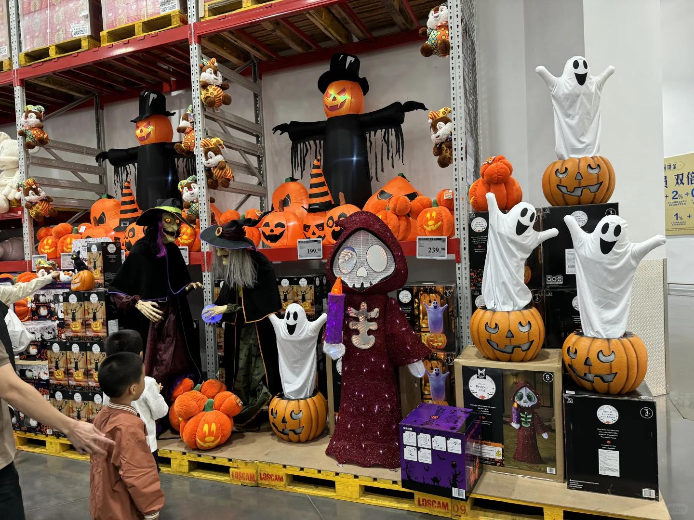
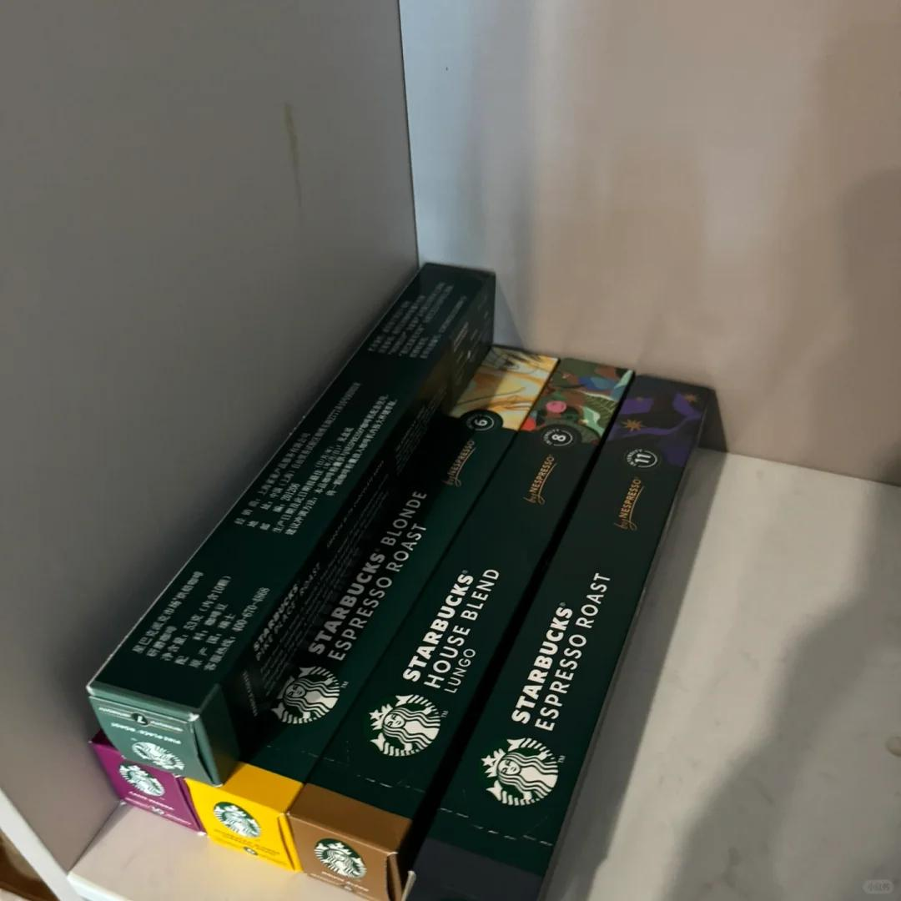

# 深圳的周末快乐碎片🧩降温啦～十月你好

周六快乐！假期快乐！今天开心心～
本来选了一个晕染的秋系美甲💅超级喜欢…
说做不了，有点复杂，想我了李姐啦！！！呜呜
就自己选了个颜色参考别人的款做了个～
等到新年再去做那个晕染吧（李姐什么都能做）
总体来说还行，自然会有些蓝调，打工人简约！
一起在做的美女说做深圳做这个色系有点早，不管嘻嘻😜
回家的路上顺便去超市买了点菜和杂粮哦吼吼，
用破壁机打了个韩式南瓜汤🎃最后加黄冰糖好喝！
顺便用咖啡机做了杯拿铁，我觉得6-8度烘焙比较好喝，
室友第一次开得11号直接给我苦没了哈哈哈
超市菠菜卖完了！最后在小青菜和生菜选了后者～
嗷嗷，生理期补一补嘎嘎快乐🎉还买了红豆红枣O
明天给家人们做红豆浆，之前做过黑豆浆黄豆浆
水果是昨天晚上逛山姆买的！大蓝莓好吃😋番茄nice，
本来看中一个红提但是剩下的几盒质量一般般……
话说，山姆的gay好多啊，昨天看到起码三对
有一对健身香香的，还偷偷摸手手，绝对是哈哈哈
【看我花融比赛咯，这个赛季第一次看，笑鼠咯】
#秋冬美甲 #每日美食分享 #做饭日记 #打工人日常 #记录我的生活 #周末快乐碎片 #健康生活 #研磨咖啡