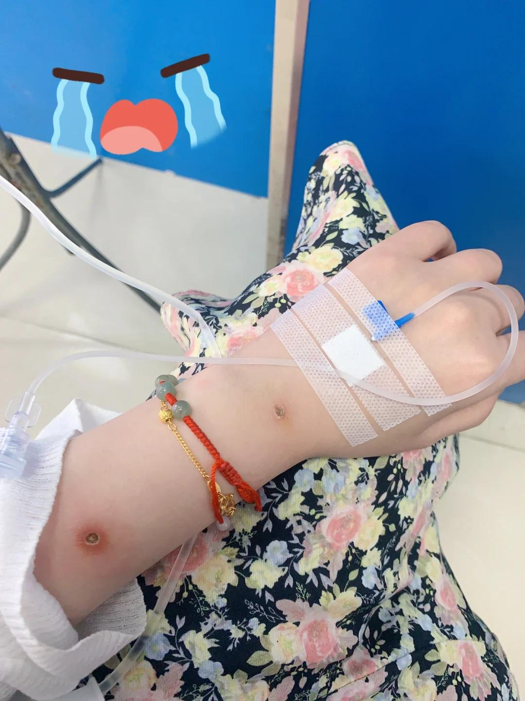

# 激光点痣伤口感染发炎了

7.31去激光的，手上胳膊还有身上一点
正常应该一周就能结疤，结果发现发炎了！
就是伤口一圈红肿还有黄白色的东西，
不出意外可能是灌脓了，硬且摸起来疼
去挂水了第二天，明天第三天继续去！
我好焦虑啊，担心会留疤或者是增长，
不知道什么时候能消炎，恢复期多久…
晚上睡觉忍不住哭了，好愁后悔夏天点
 
没有洗澡没有流汗，饮食也有控制……
真的不知道咋回事，我好害怕后面恢复期
明天再挂一天水不行就回去找那个医生了！
#激光点痣 #点痣 #点痣修复 #点痣发炎