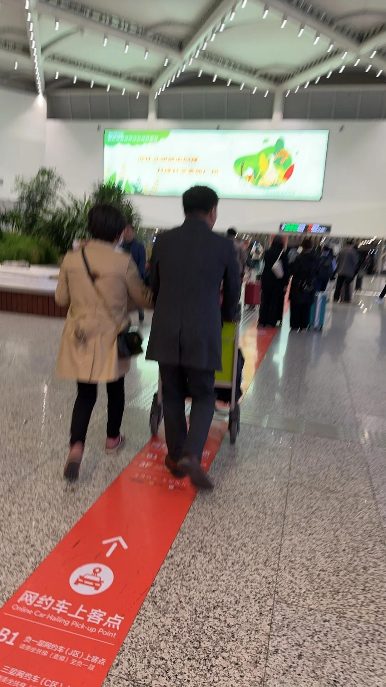
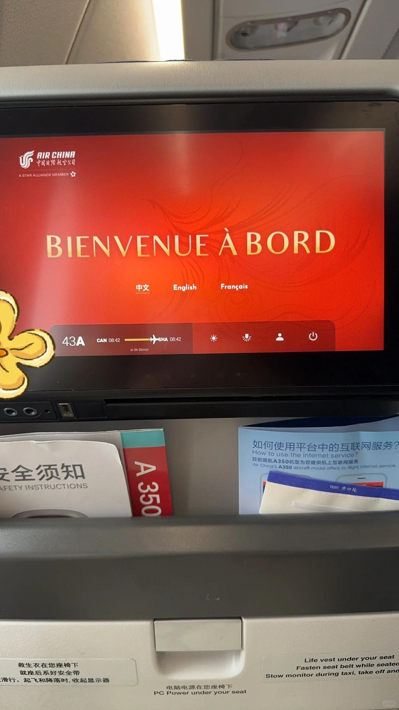
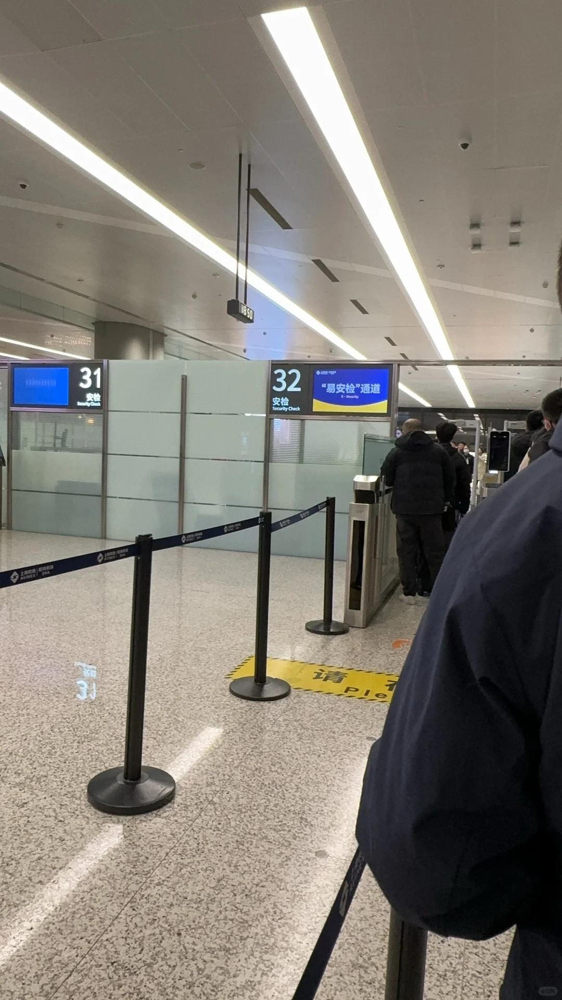
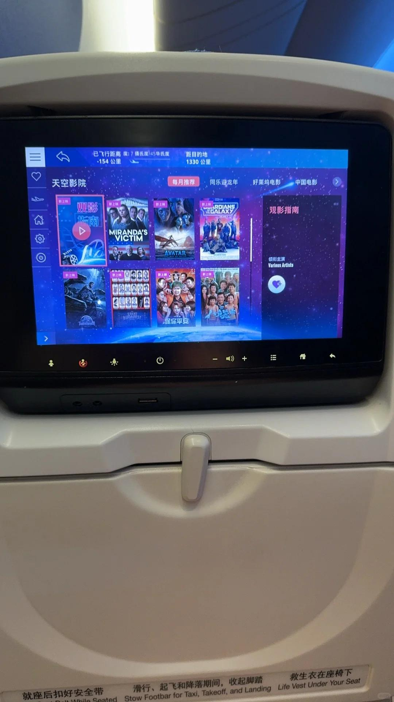
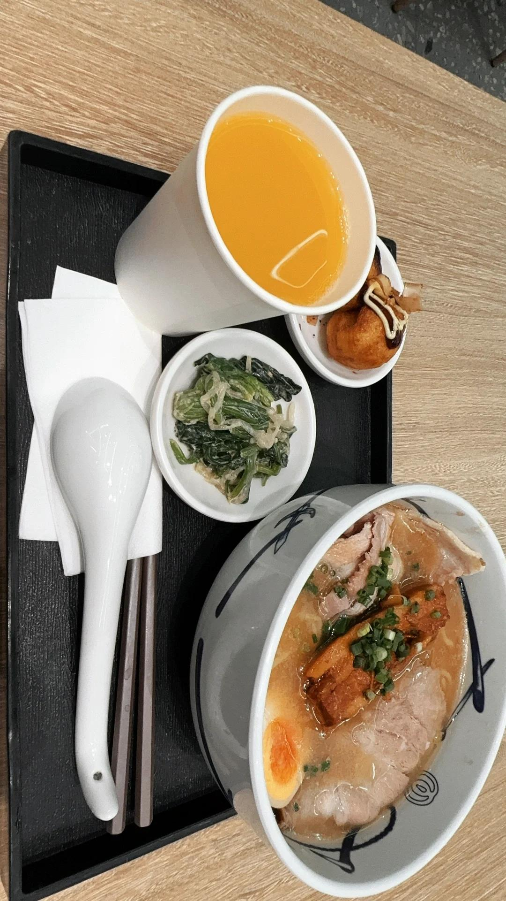
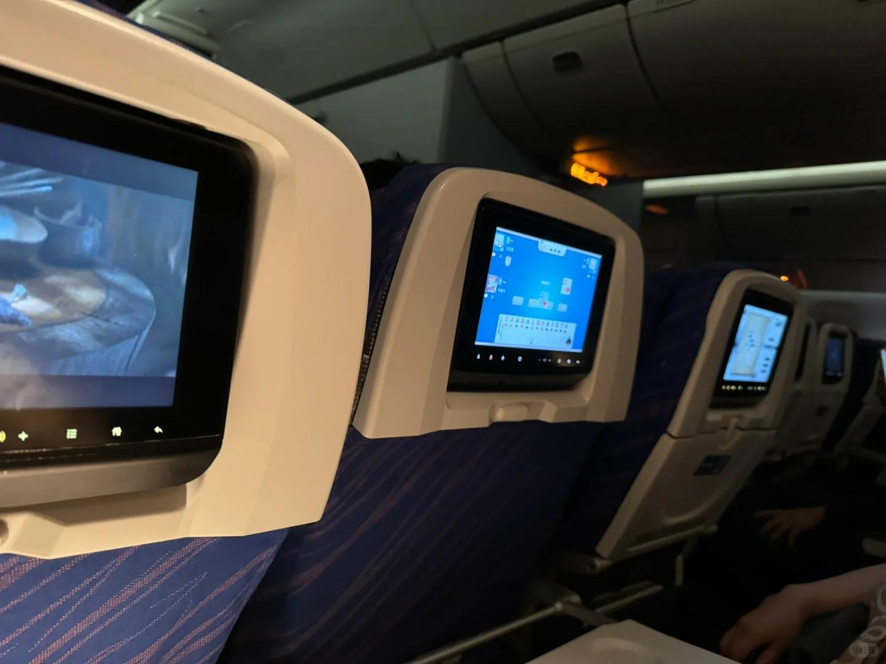

# 特种兵出差，太强了我

早上五点十分起床，洗漱化妆六点半出发，
打车七点四十到机场安检候机十一点多到达
然后继续打车，不到十二点到开会附近的商场，
吃个饭找星爸爸点杯咖啡复习稿子和材料，
五点半开完会又打车去机场堵了一个多小时，
还好司机看我赶车七点前给我送到还能恰个饭！
继续安检候机坐飞机，晚上没睡着看黑豹2，
笑死了我旁边大爷斗地主下象棋，
旁边的旁边小姐姐一开始在处理工作后来玩五子棋，
不幸的事起飞延误二十几分钟，十一点多落地，
出来打车到家凌晨十二点半算了算真的可怕，
我今天下午在我手机蹲起都开始晕眩💫
昨天晚上十二点多才睡着，满打满算四个半小时！
（回来飞机落地的时候都要yue了哈哈哈很难受）
不过好一点的是！都是宽体飞机坐得还蛮舒服
 
还有晚上落地看到一个四十左右中年男子接老婆，
不仅带了鲜花还抱起来颠了颠，很可爱！！！
我在他们后面看都笑了，很幸福，打车又遇到了他们
#打工人 #打工人日记 #出差 #特种兵旅游 #特种兵出差