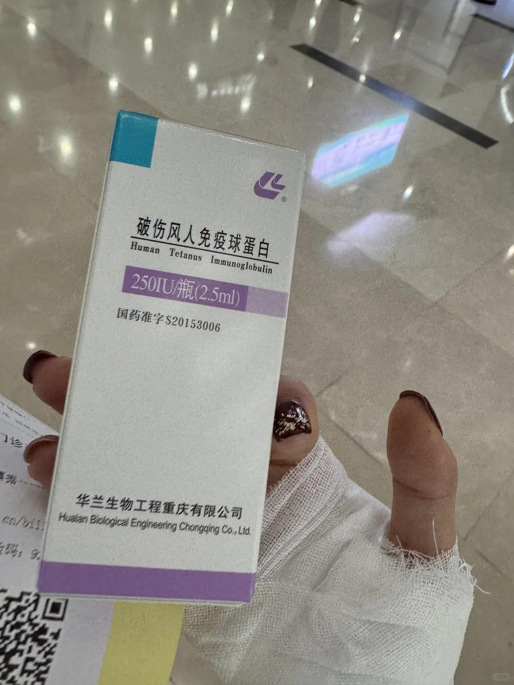
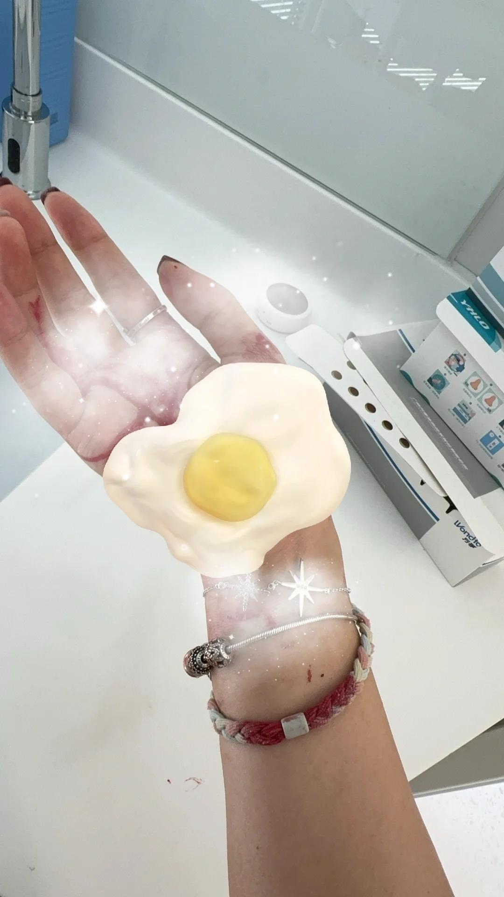
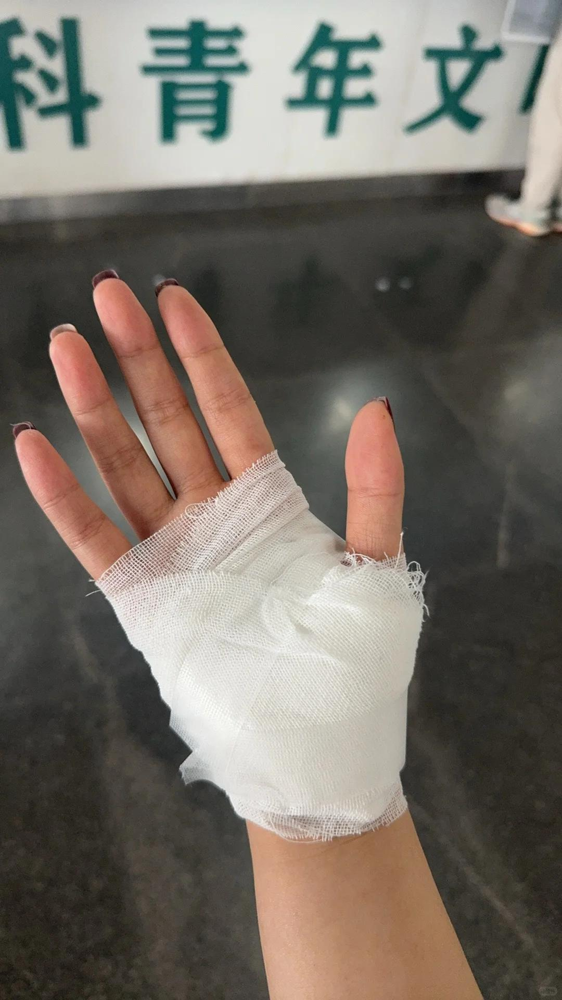

# 记录一下勇敢Heidi的一天-Part one

事发：早上起床就感觉头疼不舒服，昨天开始就有一些。走到公司楼下的时候被这种坏路绊倒了，“砰“得一声倒地，看看腿还好，再一看手，蒙了血流成河，我室友也吓傻了，让我立马把手抬起来，地上都是我的血迹。
【搞笑事件1:我俩此刻说了一句，先去打卡再去包扎】【搞笑事件2:拿起手机拍视频发给对象】【搞笑事件3:立马给领导说明情况】
 
经过1:打完卡以后就去旁边的一个健康服务站小医院去清洗伤口，生理盐水+碘伏，手掌胳膊和腿，一个护士和一个医生在搞，另一个室友也来了，两个人陪我。本来很坚强，看到室友担心的目光，一下子就落泪了～她们两个看我疼得脸色苍白，让我直接请假，摇头。
【搞笑事件4:我发现自己打卡没打上，和护士说暂停一下再去打一次】【搞笑事件5:同事让我补卡，我一本正经回复会被骂】【搞笑事件6:大家都劝我请假，我还是要处理完上楼工作】
 
经过2:服务站还是不如大医院，她们给我贴完纱布让我去医院看下，伤口有点深需要修剪，她们这里搞不了～于是到公司略微处理了一些事情挂号去医院，又折腾一次。
经过3:第一次挂号了创口整形什么科，女医生拆开纱布直接说太深了要缝针，傻眼了～我说能不能不缝针太麻烦了，他说小女孩要长好那还得精细一点不然你去急诊看看。于是我转到挂号急诊。急诊男医生说，掌心虽然有点深但还好，不用缝针，这样吧你去拍个片打个破伤风我给你清创，这些坏死组织都要剪掉，开了四个诊单让我去交钱。一个人委屈巴巴各种给对象发消息可怜宝宝
【搞笑事件7:各种凌乱很慌的我此刻聪明的想到异地医保备案并且现场操作，秒成功！】【搞笑事件8:拍DR在门口排队10分钟忘了去大厅拿号】【搞笑事件9:男朋友给我点的外卖小哥送到了第一次挂号的地方】【搞笑事件10:医生说你这三个多小时才来，我回上班，他无语了】【搞笑事件11:拍片看到别人都是两三个人，我一个人勇闯医院委屈得找妈妈，结果变成我安慰我妈】
 
经过4:拍完片去清创，男医生心狠手辣，在小手术室里也不给我打麻药！直接给我剪皮，翻我的伤口嘎嘎搞，我疼得嗷嗷大叫，还给我一直倒碘伏。他说，是不是很残忍，我说，你们都习惯了吧。搞完伤口去打破伤风，护士小姐姐不带一丝犹豫戳屁股，大家都好可怕！不顾病人的疼痛承受力吗，呜呜～
 
#摔跤 #清创 #dr #异地医保 #留疤 #伤口愈合