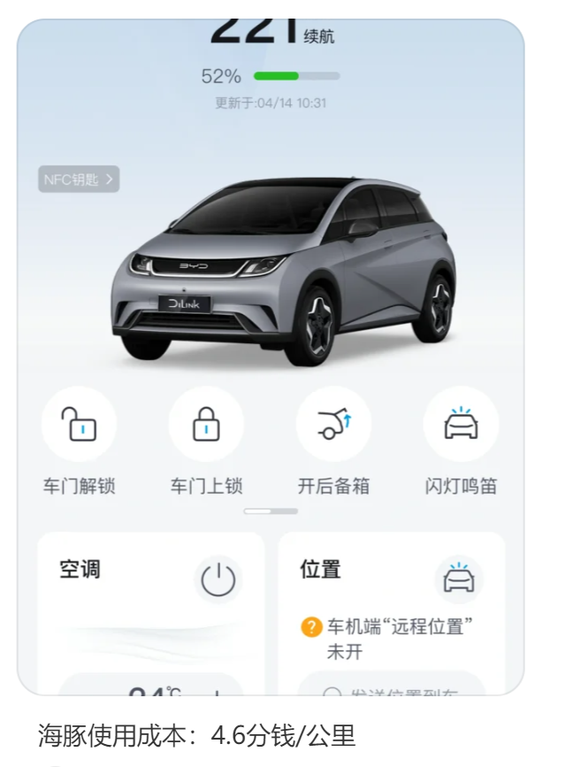
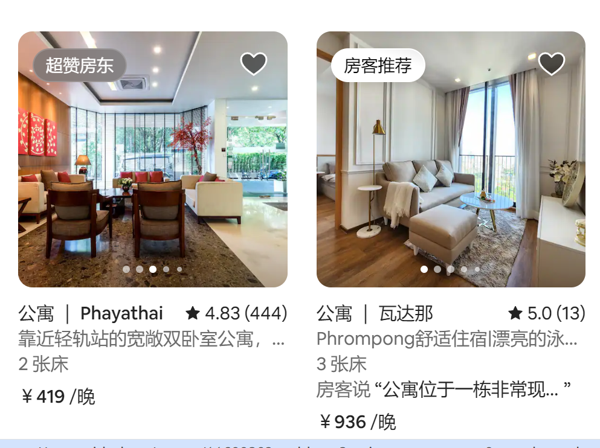
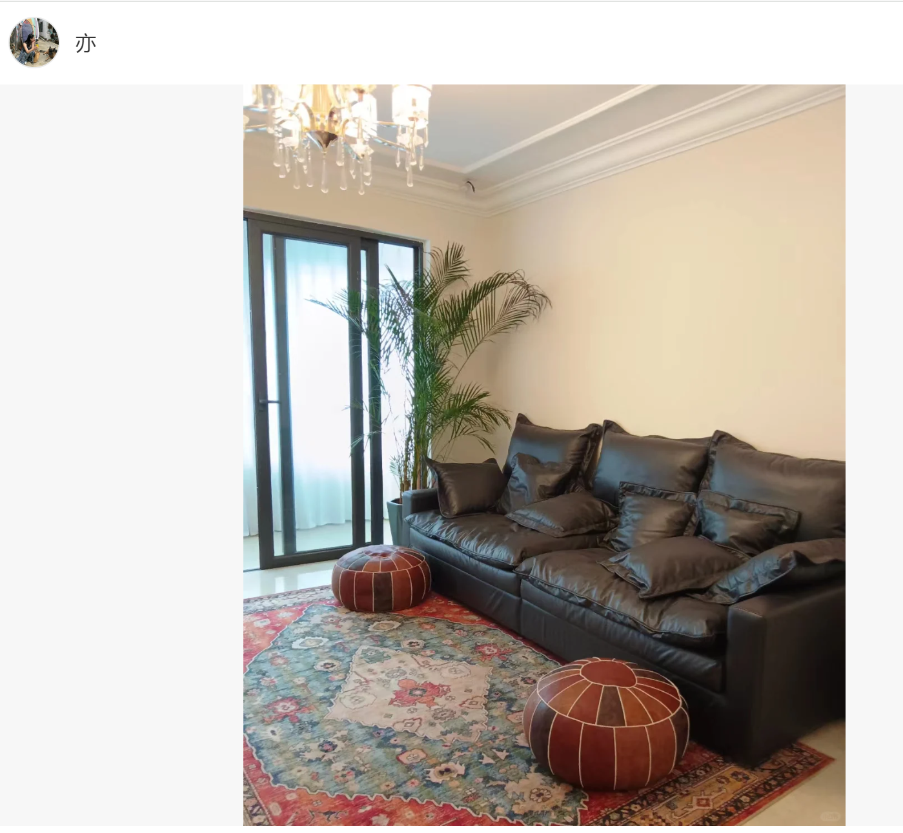

# 温州行

## 一、顺风车✳

Case：顺风车接了2个乘客，分别在100km和140km左右，
我们下单的费用是88rmb，无意间瞥见司机的收入是76rmb，平台扣除手续费约13.63%，另一位乘客司机的收入约在85rmb左右，单程收入在161rmb左右。
电车成本约5~7分/km，约7-9.8rmb，姑且算10rmb成本，利润在151rmb。

疯狂一点假设，单日2个来回，约赚600rmb

滴滴抽成约20%~40%

之前从家打快车/特惠快车到机场，200rmb司机收入约110-120rmb

这个事情可以拓展。在有稳定的顾客后，可以脱离平台，免去服务费。可能可以发现更加热门的路线。

## 二、旅馆✳

(河边旅馆已经比不上懂得做网络营销的旅馆了。比起现实中的位置，抢占在互联网上的位置更重要)

三四线城市，由于绝大多数都会在网上预定酒店，对于位置的选择只要符合预期，旅馆酒店的设施/房间照片和**价格低廉[相对]**更容易吸引顾客，对于是否邻街的考虑降低。
但是对于步行or公共交通出行的，会考虑位置和距离地铁站的影响；
自驾/打车的游客，几乎不在意。

**自家房租打造** 作为旅店出租 **闲置房间赚钱**

客人和主人同住一屋

闲置资源的利用方法。

两间房的旅馆：150*2=300，20天x300=6000。几乎没有成本。

Airbnb
**爱彼迎中国宣布自2022年7月30日起，暂停支持境内游房源、体验及相关预订** 。 根据彼时爱彼迎中国的说法，全球公共卫生事件弱化了爱彼迎境内游业务与出境游业务的协同效应，境内游业务相应地面临高成本等运营挑战。 不过，爱彼迎中国也多次表示，暂停境内游房源并不意味着退出中国市场，未来将聚焦出境游业务

## 三、小红书营销✳

(类比于刷单，精彩的比喻。通过小红书的方式来对线下进行引流。像是找人进行刷单一样。)

可以打“无广” 真实体验，甚至可以发一些本地区的游玩帖子代入感更强～

我们等于有互联网资产，没有实业资产，那么考虑到就应该是横向收购。

还有台州那个偏僻小店，泡虾记得吗？一条街就一家店在排队，而且并不好吃，包括我们那个杏仁腐，大家都不喜欢但是人们还是蜂拥而至

（你连好吃都不需要，只需要火，打卡，流量。流量的溢出效应。）

## 四、酒店格局

（明季vs全季）

房间空间面积，装修风格接近，床头小灯（54rmb）很方便
沙发、床、桌椅的设计布置

个人装修可以学习

## 五、租车

租车的收益比想象中高，国庆期间都是满荷载。

日租400，平时100~200。成本低。二手车。

## 六、游乐园

游乐园也有可写的点，你记得说可以在排队的时候摆放小店铺卖零食和水，大家在排队的时候消费更好。

还有npc现在的情绪价值，给到游客的体验感

## 七、其他

房产上涨的因果，炒房是果，人口流入大城市是因
